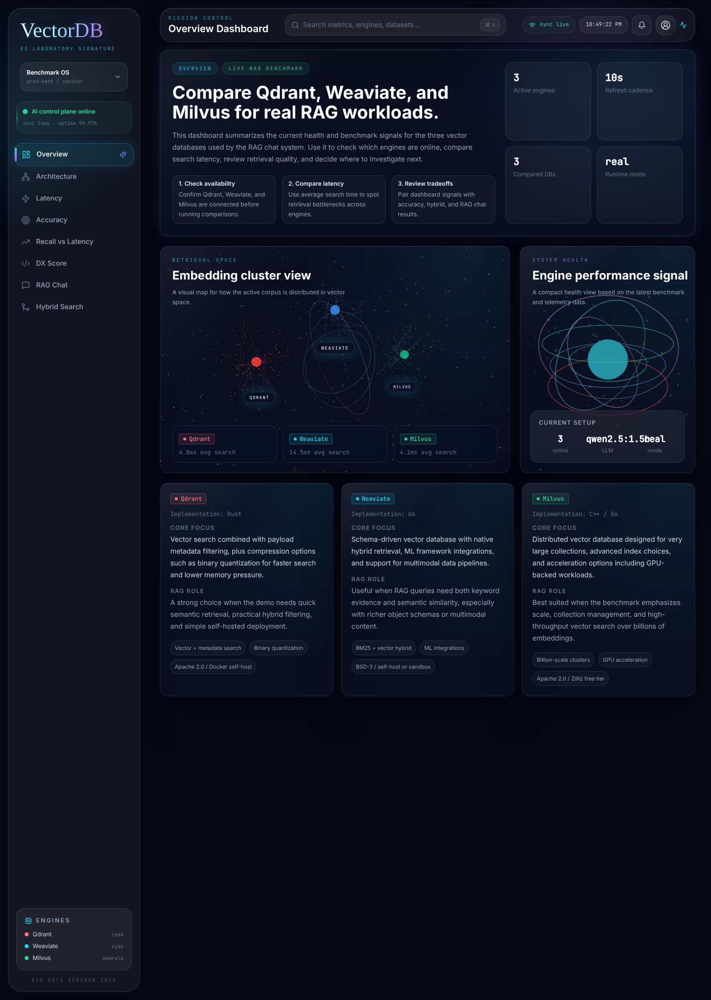
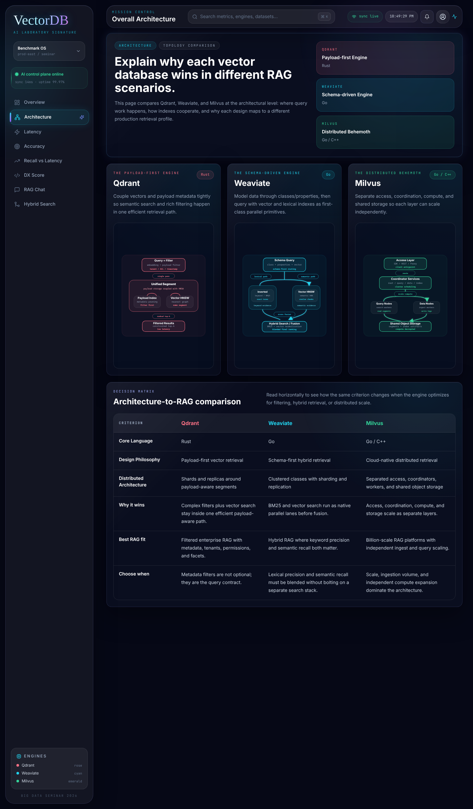
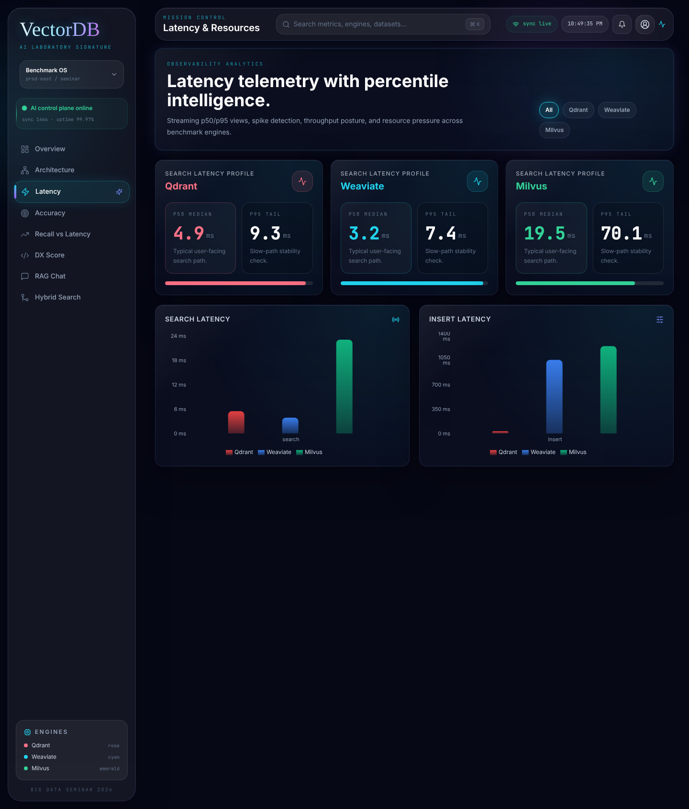
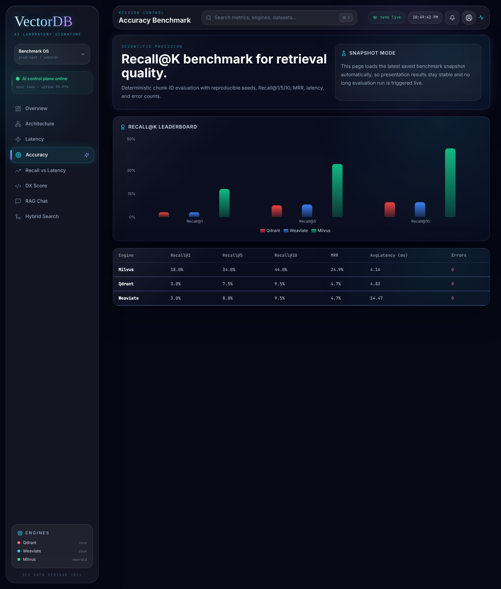
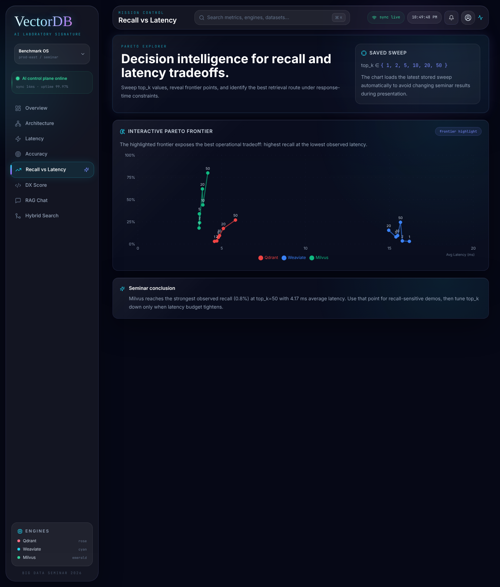
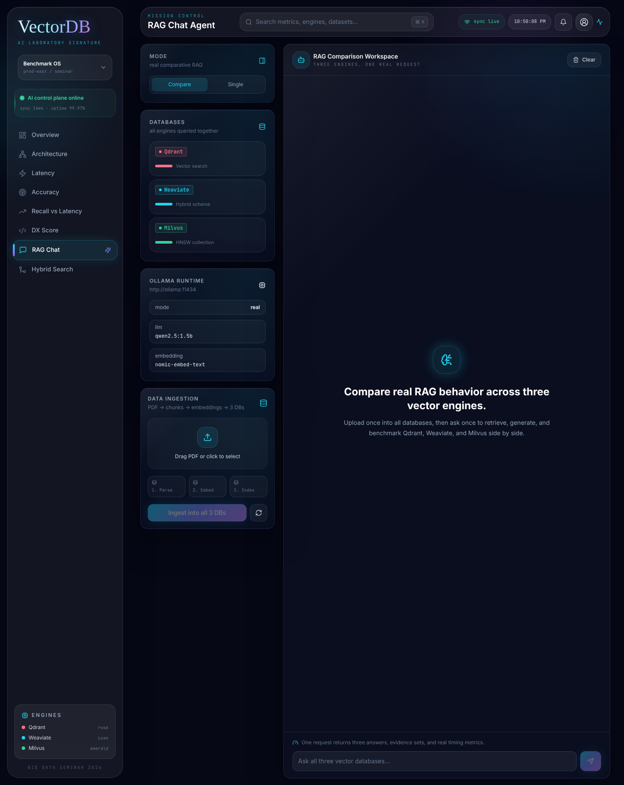
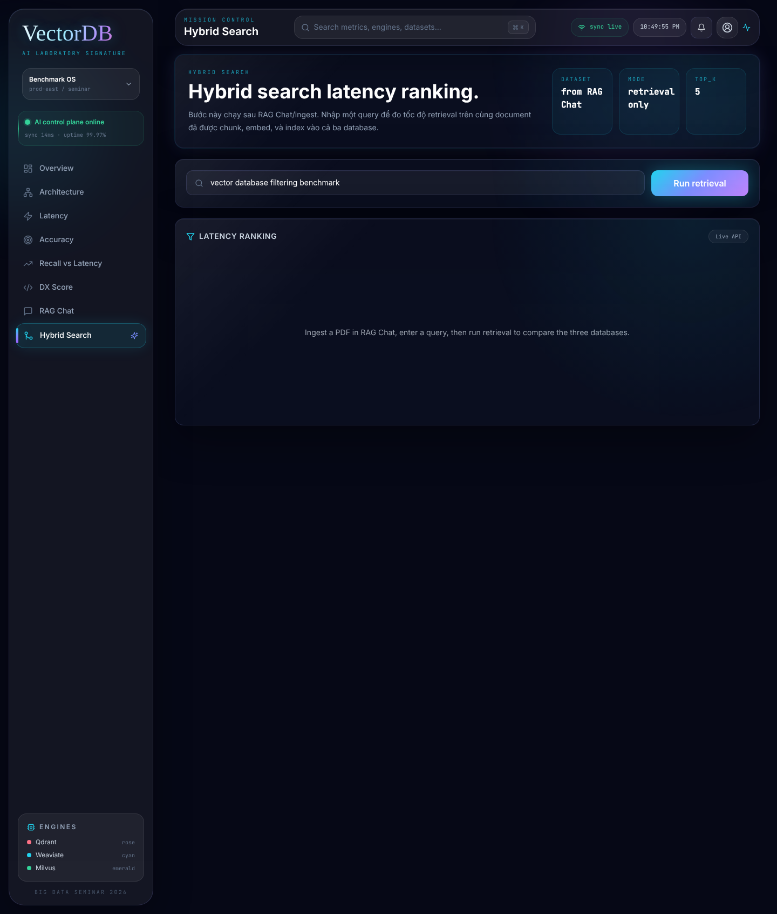
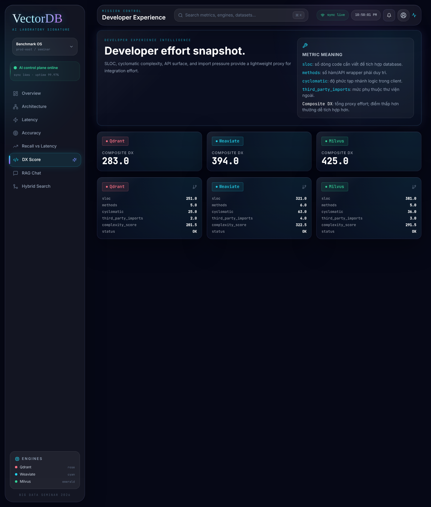

# Tài Liệu Demo Và Nội Dung Thuyết Trình Seminar

## 1. Mục Tiêu Tài Liệu

Tài liệu này dùng để chuẩn bị phần seminar cuối kỳ cho đề tài so sánh ba vector database trong hệ thống Retrieval-Augmented Generation: Qdrant, Weaviate và Milvus.

Trong phần trình bày, nhóm không chỉ giới thiệu từng công cụ riêng lẻ, mà tập trung trả lời câu hỏi thực tế: khi xây dựng một hệ thống RAG, nên chọn vector database nào trong từng bối cảnh sử dụng.

Tài liệu đáp ứng ba mục tiêu:

- Đối chiếu rõ ràng với yêu cầu trong thông báo seminar.
- Mở rộng nội dung thành câu chuyện kỹ thuật có tính thực tế.
- Cung cấp kịch bản demo và lời thoại mẫu trong khoảng 5 đến 10 phút.

## 2. Đáp Ứng Yêu Cầu Trong Thông Báo Seminar

| Yêu cầu trong thông báo | Cách đáp ứng trong bài seminar |
| :--- | :--- |
| Overview về công cụ | Trình bày mục đích của Qdrant, Weaviate, Milvus trong bài toán lưu trữ và truy vấn vector cho RAG. |
| Mục đích của công cụ | Giải thích cả ba công cụ đều dùng để lưu embedding, tìm kiếm độ tương đồng ngữ nghĩa, và trả về ngữ cảnh cho LLM sinh câu trả lời. |
| Tìm hiểu độ phổ biến công cụ | Nêu vị trí của ba công cụ trong hệ sinh thái vector database hiện nay: Qdrant mạnh về metadata filtering, Weaviate mạnh về hybrid search, Milvus mạnh về scale lớn. |
| Comment, benchmark, xếp hạng | Sử dụng benchmark nội bộ của dự án: latency, Recall@K, MRR, tradeoff giữa recall và latency, DX score. |
| Mã nguồn mở hay không | Qdrant là open-source Apache 2.0, Weaviate là open-source BSD-3, Milvus là open-source Apache 2.0. Cả ba đều có thể self-host bằng Docker. |
| Chức năng của công cụ | Trình bày ingest PDF, chunking, embedding, insert vector, vector search, metadata/hybrid search, RAG chat, benchmark. |
| Đánh giá với ít nhất 2 công cụ liên quan | So sánh cả ba công cụ: Qdrant, Weaviate, Milvus bằng bảng tiêu chí và bằng số liệu benchmark. |
| Nên lập bảng so sánh | Tài liệu có bảng so sánh theo tiêu chí kiến trúc, điểm mạnh, use case, latency, recall, DX và khả năng mở rộng. |
| Kiến trúc tổng quan mỗi công cụ | Giải thích Qdrant theo hướng payload-first, Weaviate theo hướng schema-driven hybrid retrieval, Milvus theo hướng distributed shared-storage. |
| Tìm sự khác biệt nổi bật | Chỉ ra mỗi công cụ thắng trong một bối cảnh khác nhau thay vì kết luận một công cụ tốt nhất cho mọi trường hợp. |
| Tại sao công cụ này làm tốt hơn hai công cụ còn lại | Qdrant tốt khi filter metadata là điều kiện bắt buộc; Weaviate tốt khi cần kết hợp keyword và semantic; Milvus tốt khi ưu tiên scale và throughput. |
| Demo của từng công cụ | Demo trên dashboard có đầy đủ ba DB, architecture page, latency, accuracy, tradeoff, hybrid search và RAG chat. |
| Làm nổi bật công cụ so với công cụ trước | Thứ tự demo được thiết kế để mỗi công cụ có điểm nhấn riêng: Qdrant về filter, Weaviate về hybrid, Milvus về scale và kết quả benchmark. |
| Live demo hoặc video | Có thể live demo trực tiếp; nếu rủi ro môi trường cao thì dùng video quay trước và snapshot CSV có sẵn. |
| Video phải rõ, chữ to, nền đen | Giao diện hiện tại là nền tối, phù hợp quay video; khi quay cần phóng to browser, dùng độ phân giải cao, không phụ thuộc âm thanh video. |
| Không bao gồm cài đặt và đăng ký trong demo | Demo chỉ tập trung vào chức năng và số liệu. Phần cài đặt Docker, Ollama, database không đưa vào phần demo chính. |
| Điểm cộng tính hấp dẫn và thực tế | Demo có RAG chat so sánh ba câu trả lời, biểu đồ 3D, latency, recall, tradeoff và kết luận chọn công cụ theo use case thực tế. |

## 3. Hướng Phát Triển Thêm So Với Yêu Cầu Gốc

Yêu cầu gốc của seminar là tìm hiểu, so sánh và demo công cụ. Nhóm phát triển thêm thành một bài toán có tính ra quyết định:

Thay vì hỏi "Qdrant, Weaviate, Milvus là gì", bài trình bày đặt câu hỏi "Nếu xây dựng một hệ thống RAG thật, chúng ta nên chọn vector database nào và dựa trên bằng chứng nào".

Do đó, bài seminar không dừng lại ở lý thuyết, mà thêm các điểm sau:

- Hệ thống full-stack có frontend React, backend FastAPI và ba vector database chạy trong cùng kiến trúc Docker.
- Có pipeline RAG từ PDF đến chunking, embedding, insert vector, retrieval và sinh câu trả lời.
- Có benchmark nội bộ để đánh giá bằng số liệu thay vì chỉ dựa vào mô tả của nhà cung cấp.
- Có giao diện trực quan hóa, phù hợp demo trước lớp và hỏi đáp trực tiếp.
- Có chế độ snapshot benchmark để tránh kết quả benchmark thay đổi trong lúc thuyết trình.

## 4. Tổng Quan Đề Tài

Đề tài của nhóm là xây dựng một hệ thống RAG Benchmark để so sánh Qdrant, Weaviate và Milvus.

Trong RAG, LLM không trả lời dựa trên trí nhớ mô hình một cách độc lập. Hệ thống sẽ thực hiện các bước:

1. Tải tài liệu PDF lên hệ thống.
2. Cắt tài liệu thành các đoạn văn bản nhỏ.
3. Chuyển mỗi đoạn thành embedding vector.
4. Lưu vector vào vector database.
5. Khi người dùng đặt câu hỏi, hệ thống tìm các đoạn liên quan nhất.
6. Các đoạn này được đưa vào LLM để sinh câu trả lời có ngữ cảnh.

Vector database là thành phần quyết định tốc độ truy vấn, chất lượng truy hồi và khả năng mở rộng của hệ thống RAG.

## 5. Bảng So Sánh Tổng Quan Ba Công Cụ

| Tiêu chí | Qdrant | Weaviate | Milvus |
| :--- | :--- | :--- | :--- |
| Mục tiêu chính | Vector search gắn metadata filtering | Hybrid search kết hợp vector và keyword | Vector search quy mô lớn |
| Ngôn ngữ chính | Rust | Go | Go và C++ |
| Giấy phép | Apache 2.0 | BSD-3 | Apache 2.0 |
| Điểm mạnh nổi bật | Payload-aware filtering, vận hành gọn | Schema-driven, native hybrid retrieval | Distributed architecture, scale lớn |
| Phù hợp với | RAG có tenant, ACL, metadata filter | RAG cần keyword và semantic cùng lúc | RAG có dữ liệu lớn, nhiều collection |
| Điểm cần lưu ý | Cần thiết kế payload tốt | Schema và hybrid config cần rõ ràng | Kiến trúc nhiều thành phần hơn |
| Vai trò trong demo | Nhấn mạnh filter và truy vấn có điều kiện | Nhấn mạnh hybrid retrieval | Nhấn mạnh benchmark và scale |

## 6. Kết Quả Benchmark Đang Dùng Trong Demo

Dữ liệu snapshot được lưu trong `frontend/public/benchmark-data/combined`. Snapshot giúp phần trình bày ổn định, tránh việc kết quả benchmark thay đổi do tải máy, Docker hoặc model local.

| Engine | Recall@1 | Recall@5 | Recall@10 | MRR | AvgLatency_ms | Errors |
| :--- | ---: | ---: | ---: | ---: | ---: | ---: |
| Milvus | 18.0 | 34.0 | 44.0 | 0.2492 | 4.14 | 0 |
| Qdrant | 3.0 | 7.5 | 9.5 | 0.0467 | 4.83 | 0 |
| Weaviate | 3.0 | 8.0 | 9.5 | 0.0472 | 14.47 | 0 |

Cách diễn giải khi thuyết trình:

- Milvus có kết quả recall cao nhất trong snapshot, phù hợp khi nhấn mạnh khả năng truy hồi trên tap vector lớn.
- Qdrant có latency gần Milvus và phù hợp với bài toán có filter metadata chặt chẽ.
- Weaviate có latency cao hơn trong snapshot này, nhưng điểm mạnh của Weaviate nằm ở native hybrid retrieval khi cần kết hợp keyword với vector.
- Không kết luận một công cụ tốt nhất cho mọi trường hợp. Kết luận đúng là mỗi công cụ thắng trong một bối cảnh thiết kế khác nhau.

## 7. Quy Trình Demo Chuẩn 8 Phút

### 7.1. Chuẩn Bị Trước Khi Demo

Trước khi bắt đầu, cần chuẩn bị:

- Browser mở sẵn địa chỉ frontend.
- Backend và frontend đã chạy, hoặc video demo đã quay trước.
- Nếu live backend không ổn định, dùng snapshot CSV để hiển thị latency, accuracy và tradeoff.
- Browser zoom khoảng 110 đến 125 phần trăm để chữ lớn và dễ nhìn.
- Giao diện nền đen của ứng dụng được giữ nguyên khi quay video.
- Không trình bày lệnh cài đặt Docker, npm, Python hay đăng ký cloud trong phần demo.

### 7.2. Bước 1: Dashboard Tổng Quan

Thời lượng: 0:00 đến 0:45  
Trang mở: `/dashboard`  
Mục tiêu: Đặt vấn đề và giới thiệu ba vector database.

Ảnh minh họa:

Trên hình này cần nói:

- Đây là màn hình mở đầu của demo, dùng để giới thiệu toàn bộ bài toán RAG Benchmark.
- Người nghe cần nhận ra ngay ba công cụ được so sánh là Qdrant, Weaviate và Milvus.
- Các khối 3D và thẻ thông tin cho thấy demo không chỉ là lý thuyết, mà là một hệ thống đang trực quan hóa trạng thái và kết quả benchmark.

Vì sao dashboard dùng biểu diễn 3D:

- RAG là một quy trình khó nhìn thấy trực tiếp, vì dữ liệu sau khi embedding không còn là văn bản thuần mà trở thành các vector nhiều chiều. Biểu diễn 3D giúp người nghe hình dung rằng các đoạn nội dung gần nghĩa sẽ nằm gần nhau trong không gian vector.
- Các cụm điểm trong "Embedding cluster view" không nhằm thay thế thuật toán đo chính xác, mà đóng vai trò trực quan hóa khái niệm: database đang lưu các embedding và truy vấn sẽ tìm những điểm gần nhất.
- "Engine performance signal" dùng hình ảnh chuyển động để tạo cảm giác hệ thống đang vận hành theo thời gian thực, phù hợp với mục tiêu demo trước khi đi sâu vào các metric như latency, recall và tradeoff.
- Nói cách khác, 3D được dùng để dẫn nhập trực quan: giúp người nghe hiểu bối cảnh RAG bằng hình ảnh trước, sau đó mới chứng minh bằng bảng số liệu ở các trang tiếp theo.

Cụm từ cần định nghĩa nhanh:

| Cụm từ | Định nghĩa khi thuyết trình |
| :--- | :--- |
| RAG | Retrieval-Augmented Generation, tức là LLM không trả lời một mình mà lấy thêm ngữ cảnh liên quan từ kho tài liệu trước khi sinh câu trả lời. |
| Embedding | Cách biến văn bản thành vector số để máy tính đo được mức độ gần nghĩa giữa các đoạn nội dung. |
| Vector database | Cơ sở dữ liệu chuyên lưu embedding và tìm các vector gần nhau nhất theo độ tương đồng. |
| Engine | Trong demo này, engine là từng hệ vector database được đem ra so sánh: Qdrant, Weaviate hoặc Milvus. |
| Runtime mode | Trạng thái hệ thống đang chạy thật với backend/model thật hay đang dùng chế độ mock/snapshot để demo ổn định. |

Thao tác:

- Mở dashboard.
- Chỉ vào ba engine Qdrant, Weaviate, Milvus.
- Nếu health hiện online, nhấn mạnh hệ thống đang so sánh ba engine trong cùng một kiến trúc.

Lời thoại mẫu:

"Phần demo của nhóm bắt đầu từ dashboard tổng quan. Đề tài của chúng em là so sánh ba vector database Qdrant, Weaviate và Milvus trong một hệ thống RAG. Trong kiến trúc này, tài liệu PDF sẽ được cắt thành chunk, chuyển thành embedding, lưu vào vector database, sau đó LLM dùng các chunk truy hồi được để trả lời câu hỏi.

Ở dashboard, nhóm dùng biểu diễn 3D vì embedding vốn là dữ liệu vector nhiều chiều, rất khó hình dung nếu chỉ nhìn bảng số. Không gian 3D giúp người xem thấy ý tưởng cơ bản: các đoạn nội dung gần nghĩa sẽ tạo thành các cụm gần nhau, còn truy vấn sẽ tìm những điểm liên quan nhất trong không gian đó. Phần 3D này đóng vai trò dẫn nhập trực quan; các kết luận kỹ thuật vẫn được chứng minh bằng latency, recall, tradeoff và RAG Chat ở các bước sau.

Mục tiêu của demo không phải chỉ là xem công cụ nào nhanh hơn, mà là xem mỗi công cụ phù hợp với loại bài toán RAG nào."

### 7.3. Bước 2: Kiến Trúc Và Điểm Khác Biệt

Thời lượng: 0:45 đến 1:45  
Trang mở: `/architecture`  
Mục tiêu: Đáp ứng yêu cầu kiến trúc tổng quan và làm nổi bật khác biệt.

Ảnh minh họa:

Trên hình này cần nói:

- Đây là phần đáp ứng trực tiếp yêu cầu "kiến trúc tổng quan của mỗi công cụ".
- Ba sơ đồ ở giữa giúp phân biệt triết lý thiết kế: Qdrant payload-first, Weaviate schema-driven, Milvus distributed.
- Bảng Decision Matrix phía dưới dùng để chốt vì sao mỗi công cụ thắng trong một ngữ cảnh RAG khác nhau.

Cụm từ cần định nghĩa nhanh:

| Cụm từ | Định nghĩa khi thuyết trình |
| :--- | :--- |
| Payload-first | Cách thiết kế đặt metadata như tenant, quyền truy cập, thời gian hoặc loại tài liệu gần với đường đi vector search để lọc nhanh và nhất quán. |
| Schema-driven | Cách tổ chức dữ liệu theo class, property và kiểu dữ liệu rõ ràng trước khi truy vấn. |
| Hybrid retrieval | Truy hồi kết hợp keyword search và vector search để tận dụng cả từ khóa chính xác lẫn ý nghĩa ngữ nghĩa. |
| Distributed architecture | Kiến trúc chia hệ thống thành nhiều thành phần như access, coordinator, query node, data node để mở rộng độc lập. |
| Decision Matrix | Bảng ra quyết định dùng cùng một bộ tiêu chí để so sánh các công cụ theo từng ngữ cảnh. |

Thao tác:

- Mở trang Architecture.
- Nói lần lượt theo ba cột Qdrant, Weaviate, Milvus.
- Dùng bảng decision matrix để kết luận nhanh.

Lời thoại mẫu:

"Trang này trả lời yêu cầu về kiến trúc tổng quan của từng công cụ. Qdrant có thiết kế payload-first, nghĩa là vector search và metadata filter được gắn rất chặt với nhau. Điều này phù hợp với các hệ thống RAG có tenant, phân quyền, thời gian, danh mục hoặc các điều kiện filter bắt buộc.

Weaviate là schema-driven engine. Điểm mạnh của Weaviate là nó xem hybrid retrieval là chức năng gần như native: một truy vấn có thể kết hợp keyword search theo BM25 và semantic search theo vector.

Milvus lại theo hướng distributed vector database. Kiến trúc tách access layer, coordinator, query node, data node và shared storage. Vì vậy Milvus phù hợp hơn khi bài toán đặt nặng về scale, dữ liệu lớn và throughput."

Câu chốt:

"Như vậy, khác biệt chính không nằm ở việc công cụ nào cũng lưu vector, mà nằm ở cách mỗi công cụ tối ưu đường đi truy vấn."

### 7.4. Bước 3: Latency Telemetry

Thời lượng: 1:45 đến 2:45  
Trang mở: `/latency`  
Mục tiêu: Đáp ứng phần đánh giá bằng benchmark.

Ảnh minh họa:

Trên hình này cần nói:

- Đây là phần chuyển từ kiến trúc sang số liệu đo được.
- Các thẻ p50 và p95 giúp giải thích tốc độ truy vấn ở trường hợp thông thường và trường hợp chậm.
- Hai biểu đồ Search Latency và Insert Latency dùng để so sánh chi phí truy vấn và ghi dữ liệu giữa ba database.

Cụm từ cần định nghĩa nhanh:

| Cụm từ | Định nghĩa khi thuyết trình |
| :--- | :--- |
| Latency | Độ trễ, tức thời gian hệ thống cần để hoàn thành một thao tác như insert hoặc search. |
| p50 | Giá trị trung vị: 50 phần trăm truy vấn nhanh hơn hoặc bằng mức này. |
| p95 | Giá trị tail latency: 95 phần trăm truy vấn nhanh hơn hoặc bằng mức này, dùng để xem trường hợp chậm. |
| Insert latency | Thời gian ghi vector và metadata vào database. |
| Search latency | Thời gian tìm các vector gần nhất khi người dùng đặt câu hỏi. |

Thao tác:

- Mở trang Latency.
- Chọn All để so sánh ba DB.
- Nếu cần, chọn từng DB để cho thấy chế độ focused database mode.

Lời thoại mẫu:

"Sau khi đã hiểu khác biệt kiến trúc, chúng em chuyển sang số liệu đo được. Trang Latency dùng để so sánh thời gian insert và search. Trong một hệ thống RAG, latency quan trọng vì mỗi câu hỏi của người dùng đều phải đi qua bước retrieval trước khi LLM sinh câu trả lời.

Ở đây nhóm không chỉ lấy một giá trị trung bình, mà còn quan tâm đến p50 và p95. p50 cho biết trường hợp thông thường, còn p95 cho biết đường chậm khi hệ thống có tải hoặc có truy vấn khó hơn."

Câu chốt:

"Latency giúp chúng ta đánh giá trải nghiệm người dùng, nhưng latency một mình chưa đủ. Một engine nhanh nhưng truy hồi sai ngữ cảnh thì RAG vẫn trả lời kém."

### 7.5. Bước 4: Accuracy Và Recall@K

Thời lượng: 2:45 đến 4:00  
Trang mở: `/accuracy`  
Mục tiêu: Trình bày chất lượng truy hồi bằng Recall@K và MRR.

Ảnh minh họa:

Trên hình này cần nói:

- Đây là phần đánh giá chất lượng retrieval, không chỉ đánh giá tốc độ.
- Recall@1, Recall@5, Recall@10 và MRR cho biết database có trả đúng chunk liên quan ở vị trí tốt hay không.
- Bảng kết quả phía dưới là cơ sở để giải thích vì sao dùng benchmark snapshot khi thuyết trình.

Cụm từ cần định nghĩa nhanh:

| Cụm từ | Định nghĩa khi thuyết trình |
| :--- | :--- |
| Retrieval quality | Chất lượng truy hồi, tức database có tìm được đúng đoạn tài liệu liên quan tới câu hỏi hay không. |
| Recall@K | Tỷ lệ tìm thấy kết quả đúng trong K kết quả đầu tiên; ví dụ Recall@10 kiểm tra trong 10 kết quả đầu. |
| MRR | Mean Reciprocal Rank, chỉ số đánh giá kết quả đúng nằm càng gần vị trí đầu thì điểm càng cao. |
| Chunk | Đoạn nhỏ được cắt ra từ tài liệu gốc để embedding và truy vấn trong RAG. |
| Snapshot | Bộ kết quả benchmark đã lưu sẵn để demo ổn định, tránh dao động do môi trường chạy live. |

Thao tác:

- Mở trang Accuracy.
- Chỉ vào Recall@1, Recall@5, Recall@10, MRR.
- Nếu bảng hiện snapshot, giải thích vì sao dùng snapshot.

Lời thoại mẫu:

"Trang Accuracy đo chất lượng retrieval. Trong RAG, retrieval đúng hay sai ảnh hưởng trực tiếp đến câu trả lời của LLM. Nhóm dùng các chỉ số Recall@1, Recall@5, Recall@10 và MRR.

Recall@K cho biết trong K kết quả đầu tiên, hệ thống có tìm thấy chunk đúng hay không. MRR đánh giá vị trí của kết quả đúng trong bảng xếp hạng. Kết quả snapshot hiện tại cho thấy Milvus có Recall@10 cao nhất, đạt 44.0, trong khi Qdrant và Weaviate cùng ở mức 9.5 trong lần benchmark này. AvgLatency của Milvus là 4.14 ms, Qdrant là 4.83 ms, Weaviate là 14.47 ms."

Câu chốt:

"Lý do nhóm dùng snapshot là để đảm bảo kết quả thuyết trình ổn định. Nếu chạy benchmark live trên máy khác, tải Docker và tải model local có thể làm số liệu dao động."

### 7.6. Bước 5: Tradeoff Giữa Recall Và Latency

Thời lượng: 4:00 đến 5:15  
Trang mở: `/tradeoff`  
Mục tiêu: Cho thấy đánh giá không chỉ là một chỉ số đơn lẻ.

Ảnh minh họa:

Trên hình này cần nói:

- Đây là phần giải thích rằng một hệ thống RAG phải cân bằng giữa độ chính xác và tốc độ.
- Khi tăng `top_k`, hệ thống có thể lấy được nhiều context đúng hơn, nhưng latency và chi phí xử lý có thể tăng.
- Biểu đồ Pareto giúp người nghe hiểu cách chọn database theo ràng buộc sản phẩm, thay vì chỉ nhìn một metric riêng lẻ.

Cụm từ cần định nghĩa nhanh:

| Cụm từ | Định nghĩa khi thuyết trình |
| :--- | :--- |
| Tradeoff | Sự đánh đổi giữa hai mục tiêu, ở đây là lấy kết quả chính xác hơn nhưng có thể chậm hơn. |
| top_k | Số lượng kết quả retrieval đầu tiên được lấy ra từ vector database. |
| Pareto frontier | Tập các điểm tốt nhất theo nghĩa không thể cải thiện một chỉ số mà không làm xấu chỉ số còn lại. |
| Recall vs latency | Cách nhìn đồng thời chất lượng truy hồi và tốc độ phản hồi để chọn cấu hình phù hợp. |
| Response-time constraint | Giới hạn thời gian phản hồi mà sản phẩm chấp nhận được. |

Thao tác:

- Mở trang Tradeoff.
- Chỉ vào đường Pareto hoặc các điểm theo top_k.
- Nói về top_k trong tập 1, 2, 5, 10, 20, 50.

Lời thoại mẫu:

"Trang Tradeoff giải thích mối quan hệ giữa độ chính xác và tốc độ. Khi tăng top_k, hệ thống lấy nhiều chunk hơn, có khả năng tăng recall. Nhưng đổi lại, chi phí retrieval và xử lý ngữ cảnh có thể tăng theo.

Biểu đồ này giúp chúng ta không chỉ hỏi engine nào nhanh nhất, mà hỏi engine nào đạt được mức recall chấp nhận được trong giới hạn latency cho phép."

Câu chốt:

"Trong sản phẩm thật, quyết định thường là tradeoff. Một hệ thống hỏi đáp nội bộ có thể ưu tiên accuracy, trong khi chatbot realtime có thể ưu tiên latency."

### 7.7. Bước 6: RAG Chat So Sánh Ba Engine

Thời lượng: 5:15 đến 6:45  
Trang mở: `/rag-chat`  
Mục tiêu: Demo tính thực tế và hấp dẫn của công cụ.

Ảnh minh họa:

Trên hình này cần nói:

- Đây là phần demo gần nhất với ứng dụng thực tế của người dùng cuối.
- Người dùng đặt một câu hỏi, hệ thống có thể truy vấn ba vector database và so sánh kết quả retrieval, generation, total latency.
- Sidebar upload và workspace chat cho thấy pipeline hoàn chỉnh: ingest tài liệu, hỏi đáp, lấy evidence và so sánh engine.

Cụm từ cần định nghĩa nhanh:

| Cụm từ | Định nghĩa khi thuyết trình |
| :--- | :--- |
| Ingest | Quá trình đưa tài liệu vào hệ thống: đọc file, cắt chunk, tạo embedding và lưu vào database. |
| Compare mode | Chế độ gửi cùng một câu hỏi tới cả ba database để so sánh câu trả lời, evidence và thời gian xử lý. |
| Evidence | Các đoạn tài liệu được retrieval trả về và dùng làm căn cứ cho LLM trả lời. |
| Retrieval time | Thời gian database tìm context liên quan. |
| Generation time | Thời gian LLM sinh câu trả lời sau khi đã có context. |
| Total latency | Tổng thời gian từ lúc gửi câu hỏi đến khi nhận câu trả lời. |

Thao tác:

- Mở RAG Chat.
- Để chế độ Compare nếu muốn hỏi cả ba DB cùng lúc.
- Nếu đã ingest sẵn tài liệu, nhập một câu hỏi liên quan tài liệu.
- Nếu chưa ingest, dùng video quay trước hoặc nói rõ đây là workspace để upload PDF và hỏi đáp.

Gợi ý câu hỏi:

"Vector database nào phù hợp nhất nếu hệ thống RAG cần lọc theo metadata và phân quyền người dùng?"

Lời thoại mẫu:

"Đây là phần demo gần với ứng dụng thực tế nhất. Người dùng chỉ đặt một câu hỏi, nhưng backend sẽ truy vấn cả ba vector database, lấy context, đưa vào LLM và trả về kết quả cùng với thời gian retrieval, generation và total latency.

Chế độ Compare giúp chúng ta thấy cùng một câu hỏi nhưng mỗi engine có thể trả về context khác nhau, tốc độ khác nhau và độ ổn định khác nhau. Đây là lý do nhóm không chỉ demo một database, mà đặt cả ba vào cùng một pipeline RAG."

Câu chốt:

"Phần này đáp ứng yêu cầu demo chức năng chính, không bao gồm cài đặt hay đăng ký. Người xem thấy trực tiếp giá trị của vector database trong RAG."

### 7.8. Bước 7: Hybrid Search Ranking

Thời lượng: 6:45 đến 7:30  
Trang mở: `/hybrid`  
Mục tiêu: Làm nổi bật retrieval có điều kiện và latency ranking.

Ảnh minh họa:

Trên hình này cần nói:

- Đây là phần làm nổi bật truy vấn retrieval trên cùng một query.
- Kết quả ranking cho phép so sánh database theo latency và số lượng kết quả trả về.
- Nếu backend live không sẵn sàng, fallback snapshot vẫn giúp demo đúng quy trình mà không phụ thuộc môi trường.

Cụm từ cần định nghĩa nhanh:

| Cụm từ | Định nghĩa khi thuyết trình |
| :--- | :--- |
| Hybrid Search | Truy vấn kết hợp nhiều tín hiệu tìm kiếm, thường gồm vector similarity, keyword hoặc metadata filter. |
| Query | Câu hỏi hoặc chuỗi tìm kiếm mà người dùng nhập vào hệ thống. |
| Result count | Số lượng kết quả database trả về sau một lần retrieval. |
| Latency ranking | Bảng xếp hạng database theo độ trễ, database có latency thấp hơn được xem là phản hồi nhanh hơn trong lần đo đó. |
| Fallback snapshot | Dữ liệu dự phòng đã lưu sẵn để giao diện vẫn trình bày được quy trình demo khi API live gặp lỗi. |

Thao tác:

- Mở Hybrid Search.
- Nhập query mặc định hoặc query ngắn.
- Bấm Run retrieval nếu backend sẵn sàng.
- Nếu API lỗi, trang có fallback snapshot, giải thích đây là phương án demo ổn định.

Lời thoại mẫu:

"Trang Hybrid Search tập trung vào retrieval latency khi chạy cùng một query trên ba database. Sau khi tài liệu đã được ingest, hệ thống đo tốc độ truy hồi và sắp xếp engine theo latency.

Nếu backend hybrid API không sẵn sàng trong môi trường demo, giao diện vẫn có snapshot ổn định. Đây là cách nhóm giảm rủi ro khi demo, vì trong seminar điều quan trọng là chứng minh được quy trình và cách đánh giá."

Câu chốt:

"Phần này làm rõ thêm cách nhóm biến benchmark thành công cụ ra quyết định, thay vì chỉ là bảng số liệu rời rạc."

### 7.9. Bước 8: Kết Luận Demo

Thời lượng: 7:30 đến 8:00  
Trang mở: có thể quay lại `/dashboard` hoặc giữ `/tradeoff`  
Mục tiêu: Chốt thông điệp chính.

Ảnh minh họa khuyến nghị:

Trên hình này cần nói:

- Quay lại Dashboard để nhắc lại toàn bộ câu chuyện: ba database, một pipeline RAG, nhiều góc đánh giá.
- Chốt rằng lựa chọn công cụ phụ thuộc vào use case, không nên kết luận một công cụ tốt nhất tuyệt đối.

Lời thoại mẫu:

"Kết luận của nhóm là không có một vector database tốt nhất cho mọi trường hợp. Nếu hệ thống RAG cần filter metadata, tenant và phân quyền rõ ràng, Qdrant là lựa chọn rất mạnh. Nếu bài toán cần kết hợp keyword với semantic, Weaviate có lợi thế về hybrid retrieval. Nếu bài toán ưu tiên scale lớn, nhiều vector và throughput cao, Milvus là ứng viên phù hợp.

Vì vậy, giá trị của demo này nằm ở việc chúng ta có một quy trình đánh giá: xem kiến trúc, đo latency, đo recall, xem tradeoff và chạy thử trong RAG chat."

Câu chuyển sang hỏi đáp:

"Phần trình bày của nhóm kết thúc tại đây. Nhóm sẵn sàng nhận câu hỏi về cách benchmark, cách thiết kế RAG pipeline và lý do lựa chọn từng vector database."

## 8. Phiên Bản Rút Gọn 5 Phút

Nếu thời gian bị giới hạn, dùng kịch bản sau:

| Thời gian | Nội dung | Trang |
| :--- | :--- | :--- |
| 0:00-0:40 | Giới thiệu bài toán RAG và ba database | `/dashboard` |
| 0:40-1:40 | Kiến trúc khác biệt: Qdrant, Weaviate, Milvus | `/architecture` |
| 1:40-2:40 | Số liệu accuracy và latency chính | `/accuracy` |
| 2:40-3:40 | Tradeoff giữa recall và latency | `/tradeoff` |
| 3:40-4:40 | RAG Chat Compare | `/rag-chat` |
| 4:40-5:00 | Kết luận chọn công cụ theo use case | `/dashboard` |

Nội dung cần bỏ qua trong bản 5 phút:

- Không đi sâu vào p50/p95.
- Không demo Hybrid page nếu không cần.
- Không nói chi tiết DX score.
- Không thao tác upload PDF live nếu đã có video hoặc dữ liệu sẵn.

## 9. Phiên Bản Mở Rộng 10 Phút

Nếu có 10 phút, thêm các điểm sau:

| Thời gian | Nội dung thêm | Trang |
| :--- | :--- | :--- |
| 1 phút | Nói rõ fairness protocol: cùng corpus, cùng query, cùng HNSW params | `/accuracy` |
| 1 phút | Mở DX Score để nói về độ khó tích hợp | `/dx-score` |
| 30 giây | Nếu có thời gian, mở API docs backend để cho thấy endpoint | `/docs` của FastAPI |
| 30 giây | Nếu bị hỏi, giải thích snapshot và fallback | các trang benchmark |

Ảnh minh họa cho phần DX Score:

Trên hình này cần nói:

- Đây là phần mở rộng nếu còn thời gian sau demo chính.
- DX Score giúp đánh giá chi phí tích hợp từ góc nhìn lập trình viên, không chỉ từ góc nhìn hiệu năng.
- Các chỉ số SLOC, methods, cyclomatic và third-party imports cho thấy công cụ nào có client code dễ bảo trì hơn trong codebase hiện tại.

Cụm từ cần định nghĩa nhanh:

| Cụm từ | Định nghĩa khi thuyết trình |
| :--- | :--- |
| DX | Developer Experience, tức mức độ dễ tích hợp, dễ đọc, dễ bảo trì và dễ vận hành từ góc nhìn lập trình viên. |
| SLOC | Source Lines of Code, số dòng code thực tế cần viết hoặc duy trì. |
| Cyclomatic complexity | Độ phức tạp nhánh logic trong code; càng cao thì càng khó test và bảo trì. |
| Third-party imports | Số lượng phụ thuộc thư viện bên ngoài mà phần tích hợp cần dùng. |
| Composite DX | Điểm tổng hợp từ nhiều tín hiệu DX; trong tài liệu này điểm thấp hơn thường hàm ý effort tích hợp thấp hơn. |

Lời thoại thêm cho DX Score:

"Ngoài hiệu năng, nhóm còn đánh giá Developer Experience. Một công cụ có thể nhanh, nhưng nếu client code phức tạp, nhiều dependency, nhiều nhánh xử lý lỗi, thì chi phí bảo trì sẽ cao. Vì vậy DX score dùng các proxy như SLOC, số public methods, cyclomatic complexity và third-party imports để ước lượng effort tích hợp."

## 10. Nội Dung Thuyết Trình Mẫu Theo Mạch Đầy Đủ

Phần này có thể dùng để luyện nói liên tục, không nhất thiết đọc từng chữ.

"Kính chào thầy và các bạn. Nhóm em trình bày đề tài so sánh ba vector database Qdrant, Weaviate và Milvus trong bài toán Retrieval-Augmented Generation, hay RAG.

Lý do nhóm chọn đề tài này là trong các hệ thống AI hiện nay, LLM thường không được dùng một mình. Khi cần trả lời dựa trên tài liệu nội bộ, hệ thống phải lấy thông tin liên quan từ knowledge base trước, sau đó mới đưa vào LLM. Thành phần phụ trách truy hồi đó chính là vector database.

Ba công cụ trong đề tài đều là mã nguồn mở và có thể self-host. Qdrant dùng giấy phép Apache 2.0, Weaviate dùng BSD-3, và Milvus dùng Apache 2.0. Điểm khác biệt là mỗi công cụ tối ưu cho một cách dùng khác nhau.

Qdrant nổi bật với metadata filtering. Nếu một doanh nghiệp có nhiều tenant, nhiều quyền truy cập, nhiều điều kiện lọc theo phòng ban, thời gian hoặc loại tài liệu, Qdrant có lợi thế vì payload và vector search được gắn chặt với nhau.

Weaviate nổi bật với hybrid retrieval. Trong nhiều bài toán, keyword chính xác vẫn rất quan trọng, vì người dùng có thể hỏi bằng mã sản phẩm, tên riêng, viết tắt hoặc thuật ngữ chuyên ngành. Weaviate kết hợp được lexical search và semantic search trong cùng một hướng truy vấn.

Milvus nổi bật với khả năng mở rộng. Kiến trúc của Milvus tách các thành phần như access layer, coordinator, query node, data node và shared storage. Cách thiết kế này phù hợp với hệ thống có số lượng vector lớn và cần throughput cao.

Để đánh giá ba công cụ, nhóm xây dựng một hệ thống full-stack. Frontend dùng React và Three.js để hiển thị dashboard, biểu đồ và không gian vector. Backend dùng FastAPI để cung cấp API benchmark, ingest và chat. Core Python phụ trách kết nối database, xử lý tài liệu, embedding và đo lường.

Pipeline của hệ thống gồm các bước: upload PDF, cắt chunk, tạo embedding, lưu vào ba vector database, truy vấn lại theo câu hỏi, và đưa context vào LLM để sinh câu trả lời. Nhóm sử dụng Ollama local để tránh phụ thuộc cloud và tránh chi phí.

Trong benchmark, nhóm dùng các metric chính là latency, Recall@K, MRR, tradeoff giữa recall và latency, và DX score. Latency cho biết tốc độ. Recall@K cho biết chất lượng truy hồi. MRR đánh giá vị trí của kết quả đúng trong bảng xếp hạng. Tradeoff cho thấy khi tăng top_k thì recall và latency thay đổi như thế nào. DX score ước lượng độ khó khi tích hợp công cụ vào codebase.

Kết quả snapshot hiện tại cho thấy Milvus đạt Recall@10 là 44.0 với latency trung bình 4.14 ms. Qdrant đạt Recall@10 là 9.5 với latency 4.83 ms. Weaviate đạt Recall@10 là 9.5 với latency 14.47 ms. Tuy nhiên, nhóm không kết luận Milvus luôn tốt nhất, vì benchmark này chỉ phản ánh một bối cảnh thực nghiệm. Trong bối cảnh có metadata filtering chặt chẽ, Qdrant vẫn là lựa chọn rất mạnh. Trong bối cảnh cần hybrid retrieval, Weaviate có lợi thế rõ ràng.

Phần demo của nhóm sẽ đi theo thứ tự: dashboard tổng quan, kiến trúc, latency, accuracy, tradeoff, RAG chat và hybrid search. Thứ tự này giúp người xem đi từ lý thuyết đến số liệu, sau đó đến ứng dụng thực tế.

Tại dashboard, chúng ta thấy ba engine được so sánh trong cùng một hệ thống. Tại trang architecture, chúng ta thấy mỗi database có triết lý thiết kế khác nhau. Tại trang latency và accuracy, chúng ta xem bằng chứng thực nghiệm. Tại trang tradeoff, chúng ta xem cách chọn top_k ảnh hưởng đến recall và latency. Cuối cùng, tại RAG Chat, chúng ta đặt một câu hỏi và xem ba engine trả về context, câu trả lời và thời gian xử lý như thế nào.

Thông điệp chính của nhóm là việc chọn vector database không nên dựa trên một chỉ số đơn lẻ. Cần đặt nó vào use case. Qdrant phù hợp khi filter metadata và permission là yêu cầu cốt lõi. Weaviate phù hợp khi cần kết hợp keyword với semantic search. Milvus phù hợp khi cần scale lớn và throughput cao.

Do đó, đóng góp của nhóm không chỉ là so sánh ba công cụ, mà là xây dựng một quy trình đánh giá có thể lặp lại: cùng corpus, cùng query, cùng pipeline, cùng dashboard và cùng cách diễn giải kết quả."

## 11. Câu Hỏi Q&A Dự Kiến Và Cách Trả Lời

### Câu hỏi 1: Vì sao không chọn một công cụ tốt nhất?

Trả lời mẫu:

"Vì vector database phụ thuộc rất nhiều vào use case. Nếu chỉ nhìn recall trong snapshot này, Milvus có kết quả tốt. Nhưng nếu bài toán có filter metadata và phân quyền phức tạp, Qdrant có lợi thế. Nếu cần hybrid keyword và semantic, Weaviate phù hợp hơn. Vì vậy nhóm kết luận theo bối cảnh thay vì xếp hạng tuyệt đối."

### Câu hỏi 2: Vì sao dùng snapshot thay vì benchmark live?

Trả lời mẫu:

"Benchmark live phụ thuộc vào tải máy, trạng thái Docker, cache, model embedding và các tiến trình nền. Để đảm bảo seminar ổn định, nhóm dùng snapshot cho các biểu đồ chính. Tuy nhiên, hệ thống vẫn có API để chạy benchmark live khi môi trường sẵn sàng."

### Câu hỏi 3: Benchmark có công bằng không?

Trả lời mẫu:

"Nhóm có thiết kế fairness protocol: cùng corpus, cùng query, cùng metric, cùng pipeline RAG và cùng tập chỉ số đánh giá. Mục tiêu là so sánh trong một môi trường thực nghiệm nhất quán, không tùy biến riêng để làm lợi cho một database."

### Câu hỏi 4: Tại sao Weaviate latency cao hơn trong snapshot?

Trả lời mẫu:

"Trong snapshot này, Weaviate có latency cao hơn. Tuy nhiên, điểm mạnh của Weaviate không chỉ nằm ở latency thuần, mà ở native hybrid retrieval và schema-driven design. Nếu bài toán cần keyword evidence kết hợp với semantic similarity, Weaviate vẫn có giá trị riêng."

### Câu hỏi 5: Nếu xây dựng sản phẩm thật, nhóm sẽ chọn công cụ nào?

Trả lời mẫu:

"Nếu sản phẩm là knowledge base nội bộ có phân quyền và metadata rõ ràng, em sẽ ưu tiên Qdrant. Nếu sản phẩm cần search trên nhiều thuật ngữ chính xác và ngữ nghĩa, em sẽ cân nhắc Weaviate. Nếu sản phẩm có quy mô vector rất lớn và cần mở rộng hạ tầng, em sẽ cân nhắc Milvus."

## 12. Checklist Trước Khi Trình Bày

- Frontend truy cập được.
- Nếu demo live, backend health hiện rõ trạng thái Qdrant, Weaviate và Milvus.
- Browser đã zoom lớn để chữ dễ đọc.
- Các tab cần demo đã mở sẵn theo thứ tự: Dashboard, Architecture, Latency, Accuracy, Tradeoff, RAG Chat, Hybrid.
- Có video quay trước để dự phòng.
- Không trình bày cài đặt, lệnh Docker, npm install hoặc đăng ký cloud trong thời gian demo.
- Khi nói về số liệu, nhắc rõ đây là snapshot benchmark để đảm bảo ổn định.
- Kết luận theo use case, không nói một công cụ tốt nhất tuyệt đối.

## 13. Kết Luận Cuối Cùng

Bài seminar đáp ứng đầy đủ các yêu cầu trong thông báo: có overview, có mã nguồn mở, có chức năng, có kiến trúc, có bảng so sánh, có đánh giá bằng benchmark, có demo từng công cụ và có phần thực tế hấp dẫn.

Hướng phát triển thêm của nhóm là biến bài seminar thành một quy trình ra quyết định cho RAG: chọn vector database dựa trên kiến trúc, latency, accuracy, tradeoff, DX và bối cảnh ứng dụng.

Thông điệp nên giữ nhất quán khi thuyết trình:

"Không có vector database tốt nhất cho mọi bài toán. Chỉ có vector database phù hợp nhất với ràng buộc và mục tiêu của hệ thống RAG đang xây dựng."
