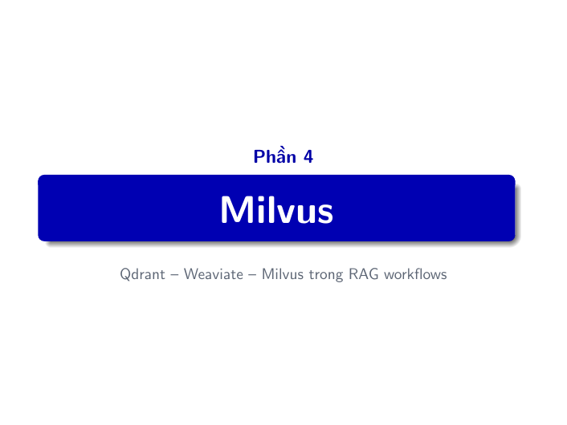
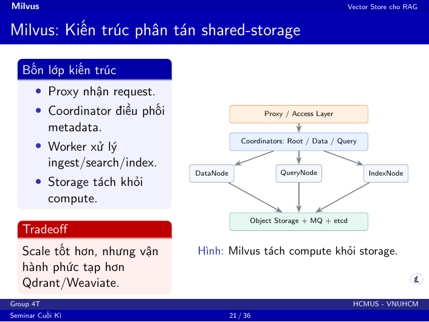
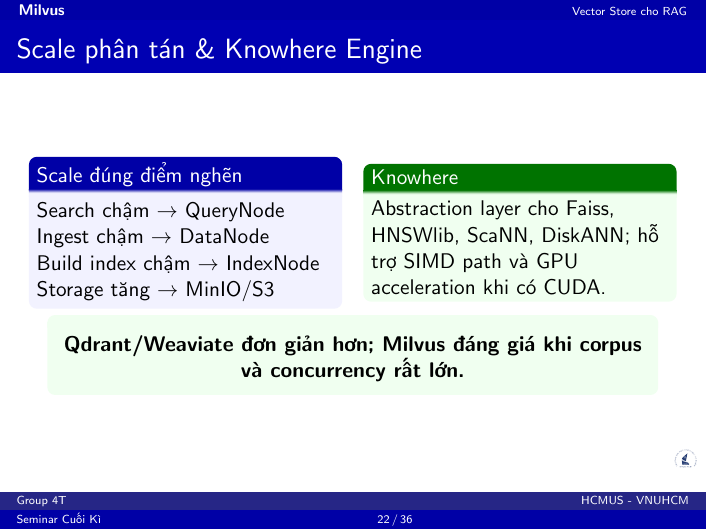
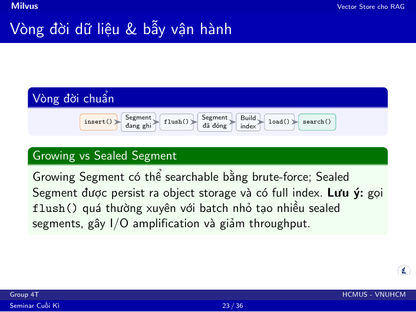
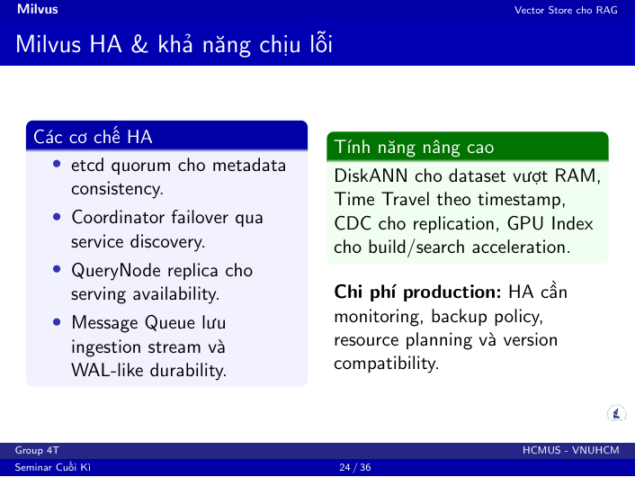
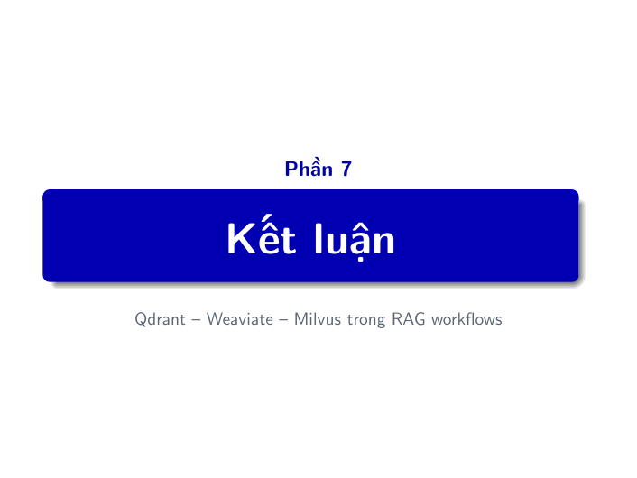
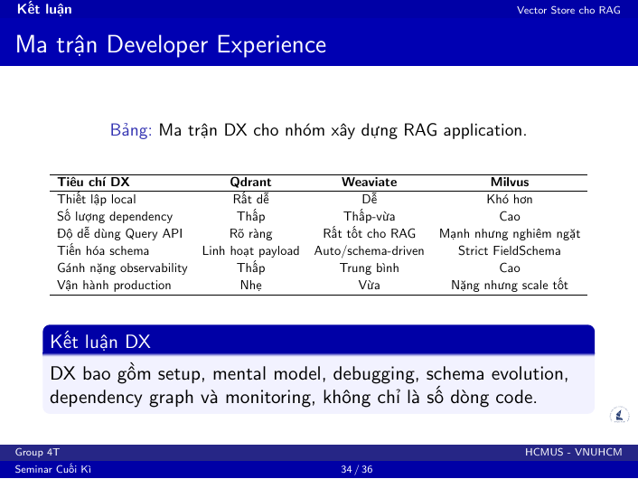
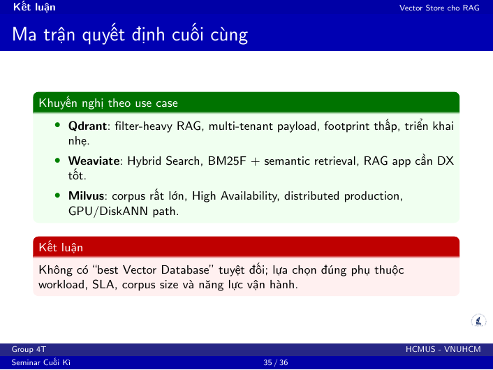

# Kịch bản thuyết trình - Trần Hữu Kim Thành (23120166)

**Vai trò:** Milvus, lifecycle, HA, Developer Experience, kết luận.  
**Thời lượng gợi ý:** 9-10 phút.  
**Mục tiêu:** Làm rõ Milvus phù hợp với corpus lớn, distributed production và yêu cầu High Availability.

## Slide PDF 20 - Divider: Milvus

**Nội dung thuyết trình:**

Sau Qdrant và Weaviate, em sẽ trình bày Milvus. Đây là công cụ có thiết kế khác biệt nhất trong ba hệ thống vì nó đi theo hướng distributed-first.

**Chuyển tiếp:** Nếu Qdrant và Weaviate tương đối gọn cho local/self-host nhỏ, Milvus đáng chú ý khi bài toán bắt đầu quan tâm đến scale lớn, HA và tách compute khỏi storage.

## Slide PDF 21 - Milvus: Kiến trúc phân tán shared-storage

**Nội dung thuyết trình:**

Milvus có bốn lớp kiến trúc chính.

Proxy là access layer nhận request từ client. Coordinator quản lý metadata, topology và điều phối. Worker nodes xử lý ingest, search và build index. Storage layer tách riêng, gồm object storage, message queue và etcd.

Cách thiết kế này nặng hơn Qdrant và Weaviate, nhưng cho phép scale từng phần độc lập. Nếu search chậm, có thể thêm QueryNode. Nếu ingest chậm, thêm DataNode. Nếu build index chậm, thêm IndexNode.

**Câu chốt:** Milvus đánh đổi sự đơn giản để lấy khả năng mở rộng và vận hành production lớn.

## Slide PDF 22 - Scale phân tán và Knowhere Engine

**Nội dung thuyết trình:**

Milvus tách các điểm nghẽn thành các role riêng. Search, ingest, build index và storage có thể scale theo nhu cầu riêng thay vì phải scale toàn bộ hệ thống.

Knowhere là lớp thực thi vector search bên dưới Milvus. Nó wrap các thư viện như Faiss, HNSWlib, ScaNN và DiskANN. Khi có phần cứng phù hợp, Milvus cũng có đường GPU acceleration.

Vì vậy Milvus phù hợp với corpus rất lớn, concurrency cao hoặc enterprise RAG, nơi khả năng scale quan trọng hơn sự đơn giản khi triển khai.

**Câu chốt:** Qdrant và Weaviate đơn giản hơn; Milvus đáng giá khi corpus và concurrency thật sự lớn.

## Slide PDF 23 - Vòng đời dữ liệu và bẫy vận hành

**Nội dung thuyết trình:**

Milvus có lifecycle rõ hơn hai hệ còn lại. Khi insert, dữ liệu vào growing segment. Growing segment có thể search ngay bằng brute-force. Khi flush, segment được đóng thành sealed segment và persist ra object storage.

Sau đó hệ thống build index, rồi load index vào QueryNode RAM để search tối ưu.

Điểm cần chú ý là không nên gọi flush quá thường xuyên với batch nhỏ. Việc này tạo nhiều sealed segment nhỏ, gây I/O amplification và làm giảm throughput.

**Câu chốt:** Khi benchmark Milvus, phải tách riêng insert, flush, load và search; nếu gộp lại sẽ rất dễ kết luận sai về latency.

## Slide PDF 24 - Milvus HA và khả năng chịu lỗi

**Nội dung thuyết trình:**

Milvus hướng đến production nên có nhiều cơ chế HA. etcd quorum giúp đảm bảo metadata consistency. Coordinator có thể failover thông qua service discovery. QueryNode replica giúp tăng availability cho serving. Message Queue giữ ingestion stream và đóng vai trò durability cho dữ liệu ghi.

Ngoài ra Milvus có các tính năng nâng cao như DiskANN cho dataset vượt RAM, Time Travel theo timestamp, CDC cho replication và GPU index cho acceleration.

**Câu chốt:** Milvus phù hợp khi scale và HA quan trọng hơn sự đơn giản của hệ thống.

## Slide PDF 33 - Divider: Kết luận

**Nội dung thuyết trình:**

Sau phần kiến trúc và benchmark, phần cuối sẽ tổng hợp lại dưới góc nhìn Developer Experience và quyết định chọn công cụ.

**Chuyển tiếp:** Khi chọn database cho RAG, ngoài tốc độ và recall, nhóm cũng cần xét chi phí tích hợp và vận hành.

## Slide PDF 34 - Ma trận Developer Experience

**Nội dung thuyết trình:**

Developer Experience không chỉ là số dòng code. Nó bao gồm setup, mental model, debugging, schema evolution, dependency graph, observability và vận hành production.

Qdrant dễ thiết lập local nhất vì ít dependency và API payload filter rõ. Weaviate có DX tốt cho RAG app vì query API hỗ trợ hybrid search trực tiếp. Milvus mạnh nhưng nghiêm ngặt hơn, cần hiểu schema, collection lifecycle, index, load và nhiều thành phần phụ.

**Câu chốt:** Một database mạnh về kiến trúc chưa chắc rẻ về chi phí vận hành; DX là yếu tố thực dụng khi chọn công cụ.

## Slide PDF 35 - Ma trận quyết định cuối cùng

**Nội dung thuyết trình:**

Kết luận theo use case:

Chọn Qdrant nếu hệ thống cần filtered retrieval, multi-tenant payload, footprint thấp và triển khai nhẹ.

Chọn Weaviate nếu hệ thống cần Hybrid Search, tức BM25F kết hợp semantic retrieval, và muốn developer experience tốt cho RAG app.

Chọn Milvus nếu corpus rất lớn, cần High Availability, distributed production, GPU hoặc DiskANN path.

**Câu chốt quan trọng:** Không có "best Vector Database" tuyệt đối; chỉ có lựa chọn phù hợp nhất với workload, SLA, corpus size và năng lực vận hành.

## Slide PDF 36 - Thank you / Q&A

**Nội dung thuyết trình:**

Phần trình bày của nhóm kết thúc tại đây. Nhóm sẵn sàng nhận câu hỏi về kiến trúc RAG, giao thức benchmark, cách thiết kế demo và lý do lựa chọn Qdrant, Weaviate hoặc Milvus trong từng bối cảnh.

**Câu mở Q&A:** Nếu thầy hoặc các bạn muốn hỏi sâu hơn, nhóm có thể giải thích thêm về pipeline Docker, các endpoint FastAPI, hoặc cách tính Recall@K và MRR trong benchmark.

## Demo do Thành phụ trách - Milvus lifecycle và scale

**Trang:** `/architecture`, `/rag-chat` hoặc `/latency`  
**Thời lượng:** 90-120 giây.

**Lời thoại demo:**

Phần demo Milvus tập trung vào lifecycle và tư duy scale. Trong giao diện local, ta thấy Milvus như một vector database bình thường. Nhưng phía sau, Milvus có các khái niệm như Proxy, Coordinator, QueryNode, DataNode, IndexNode và Storage.

Khi ingest dữ liệu, Milvus có growing segment, flush, sealed segment, build index và load. Đây là điểm khác với Qdrant và Weaviate, nên khi benchmark phải đọc kỹ lifecycle.

**Câu chốt demo:** Milvus phù hợp khi hệ thống cần scale lớn và HA, nhưng đổi lại chi phí vận hành cao hơn.

## Câu trả lời dự phòng cho phần Q&A

### Vì sao Milvus nặng hơn nhưng vẫn đáng dùng?

Vì Milvus được thiết kế cho workload lớn. Khi corpus và concurrency tăng, khả năng scale QueryNode, DataNode, IndexNode và storage độc lập sẽ quan trọng hơn việc chạy gọn trong một container.

### Khi nào không nên chọn Milvus?

Nếu bài toán chỉ là prototype nhỏ, corpus vừa phải, team ít người và không có yêu cầu HA phức tạp, Qdrant hoặc Weaviate thường dễ vận hành hơn.

### Kết luận cuối cùng của nhóm là gì?

Qdrant cho filtered RAG gọn và nhanh. Weaviate cho hybrid RAG có keyword + semantic. Milvus cho scale lớn và production phân tán. Lựa chọn đúng phụ thuộc ràng buộc của hệ thống.
