# Kịch bản thuyết trình - Lê Xuân Trí (23120099)

**Vai trò:** Mở đầu, tổng quan RAG, hệ thống demo, benchmark results.  
**Thời lượng gợi ý:** 9-10 phút.  
**Mục tiêu:** Đặt bối cảnh cho toàn bài và chứng minh nhóm có hệ thống benchmark full-stack thật.

## Slide PDF 1 - Title

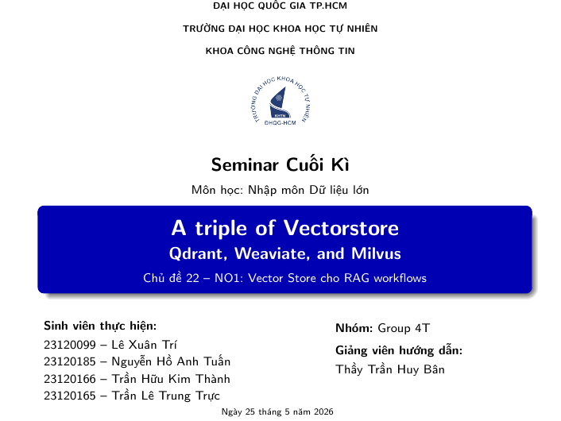

**Nội dung thuyết trình:**

Kính chào thầy và các bạn. Nhóm em trình bày đề tài **A triple of Vectorstore: Qdrant, Weaviate, and Milvus**, thuộc chủ đề Vector Store cho RAG workflows.

Mục tiêu của nhóm không chỉ là giới thiệu từng công cụ riêng lẻ, mà là trả lời một câu hỏi thực tế: nếu xây dựng một hệ thống RAG, chúng ta nên chọn vector database nào trong từng bối cảnh sử dụng?

Trong bài này, nhóm sẽ so sánh ba công cụ mã nguồn mở phổ biến là Qdrant, Weaviate và Milvus theo ba góc nhìn: kiến trúc, hiệu năng benchmark và chi phí vận hành.

**Điểm nhấn:** Giới thiệu đủ 4 thành viên và nhấn mạnh đây là bài có hệ thống demo thật, không chỉ tổng hợp lý thuyết.

## Slide PDF 2 - Divider: Giới thiệu

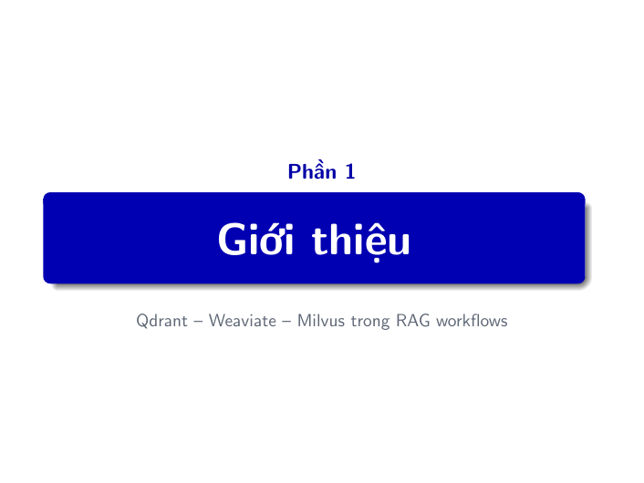

**Nội dung thuyết trình:**

Phần đầu tiên là phần giới thiệu. Em sẽ bắt đầu từ bài toán RAG, lý do cần Vector Database, sau đó dẫn vào ba công cụ chính mà nhóm lựa chọn để phân tích.

**Chuyển tiếp:** Trước khi so sánh Qdrant, Weaviate và Milvus, mình cần hiểu Vector Database nằm ở đâu trong hệ thống RAG.

## Slide PDF 3 - Mục lục

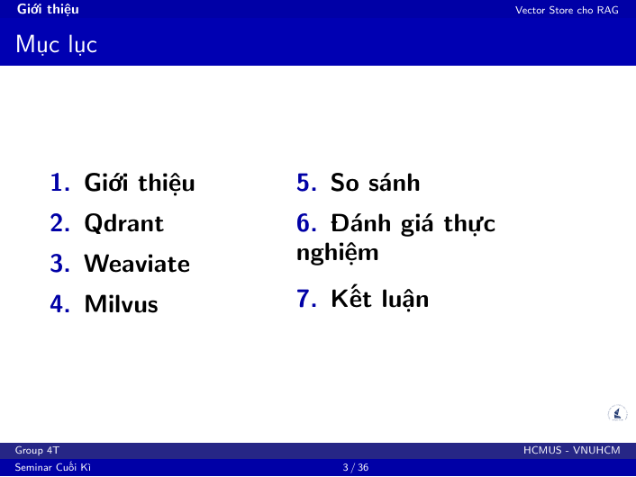

**Nội dung thuyết trình:**

Bài trình bày gồm bảy phần. Đầu tiên là giới thiệu bài toán và vai trò của Vector Database. Sau đó nhóm lần lượt đi qua Qdrant, Weaviate và Milvus.

Sau khi hiểu từng công cụ, nhóm sẽ so sánh trực tiếp, trình bày phần đánh giá thực nghiệm, rồi kết luận bằng ma trận lựa chọn theo use case.

**Câu chốt:** Mạch bài đi từ vấn đề, đến công cụ, đến số liệu, rồi đến quyết định kỹ thuật.

## Slide PDF 4 - Mục tiêu và mạch trình bày

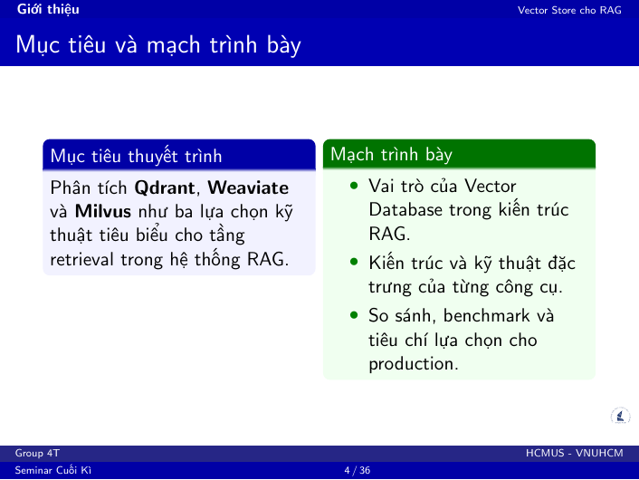

**Nội dung thuyết trình:**

Mục tiêu của bài là phân tích Qdrant, Weaviate và Milvus như ba lựa chọn tiêu biểu cho tầng retrieval trong hệ thống RAG.

Trong RAG, LLM không nên trả lời chỉ dựa trên trí nhớ mô hình. Hệ thống cần lấy các đoạn tài liệu liên quan trước, đưa vào prompt, rồi LLM mới sinh câu trả lời. Vì vậy tầng retrieval ảnh hưởng trực tiếp đến độ đúng của câu trả lời.

Nhóm sẽ đánh giá theo ba trục:

- Kiến trúc: mỗi công cụ tối ưu cho điều gì?
- Hiệu năng: latency, Recall@K, MRR và tradeoff.
- Vận hành: dependency, schema, monitoring và triển khai Docker/local.

**Chuyển tiếp:** Từ đây, ta đi vào lý do vì sao Vector Database cần thiết.

## Slide PDF 5 - Vì sao cần Vector Database?

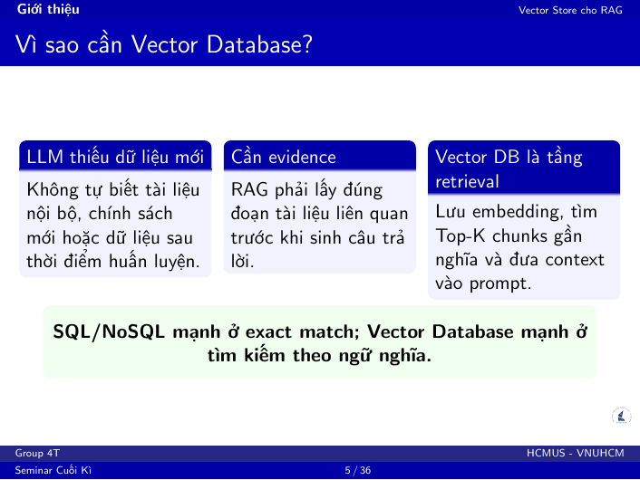

**Nội dung thuyết trình:**

LLM có ba giới hạn lớn. Thứ nhất, nó không tự biết dữ liệu nội bộ như tài liệu công ty, bài giảng riêng hoặc chính sách mới. Thứ hai, nó không cập nhật liên tục sau thời điểm huấn luyện. Thứ ba, khi thiếu context, LLM có thể hallucinate, tức là trả lời tự tin nhưng sai.

RAG giải quyết bằng cách thêm bước retrieval trước khi generation. Tài liệu được chia thành chunk, chuyển thành embedding vector, lưu vào Vector Database. Khi người dùng hỏi, câu hỏi cũng được chuyển thành vector, sau đó database tìm các chunk gần nghĩa nhất.

**Câu chốt:** SQL/NoSQL mạnh ở exact match; Vector Database mạnh ở tìm kiếm theo ngữ nghĩa.

## Slide PDF 6 - Kiến trúc pipeline RAG

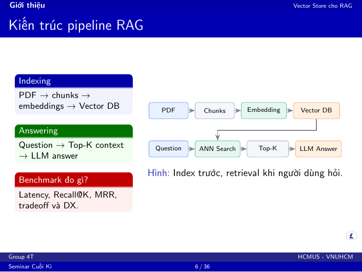

**Nội dung thuyết trình:**

Pipeline RAG có hai pha chính.

Pha indexing: PDF được cắt thành chunks, mỗi chunk được embedding thành vector, rồi lưu vào Vector Database kèm metadata.

Pha answering: câu hỏi của người dùng được embedding, database tìm Top-K context liên quan, rồi LLM dùng context đó để sinh câu trả lời.

Nếu retrieval sai, LLM sẽ không có evidence đúng. Khi đó câu trả lời vẫn có thể sai dù model ngôn ngữ rất mạnh. Vì vậy benchmark Vector Database không chỉ đo tốc độ, mà còn phải đo chất lượng truy hồi.

**Giải thích metric nhanh:**

- Latency: truy vấn nhanh hay chậm.
- Recall@K: trong K kết quả đầu có chứa chunk đúng không.
- MRR: chunk đúng xuất hiện càng sớm thì điểm càng cao.

## Slide PDF 7 - Hệ thống demo: từ benchmark đến dashboard

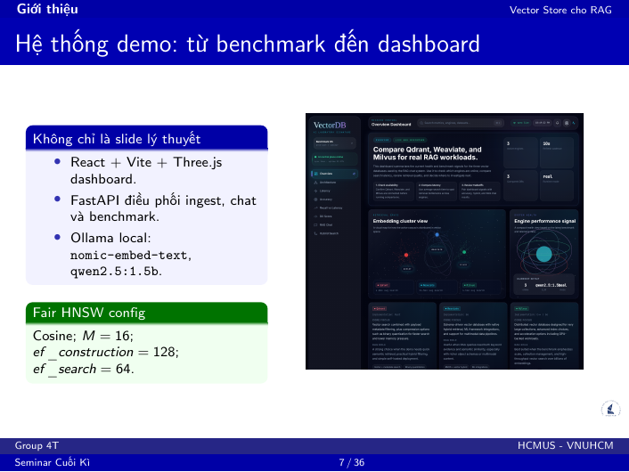

**Nội dung thuyết trình:**

Nhóm không chỉ làm slide lý thuyết. Hệ thống demo là một app full-stack gồm frontend React + Vite + Three.js, backend FastAPI, core Python benchmark logic, và ba Vector Database chạy bằng Docker Compose.

Ollama local được dùng cho embedding model `nomic-embed-text` và LLM nhẹ `qwen2.5:1.5b`. Các database được đặt trong cùng một pipeline để có thể so sánh trên cùng dữ liệu, cùng query và cùng cấu hình HNSW.

Các endpoint chính gồm health check, metrics, resources, ingest PDF, chat RAG, accuracy benchmark và tradeoff benchmark.

**Câu chốt:** Đây là hệ thống benchmark thật, còn slide chỉ là phần trình bày kết quả và phân tích.

## Slide PDF 8 - Ba hệ quản trị Vector Database tiêu biểu

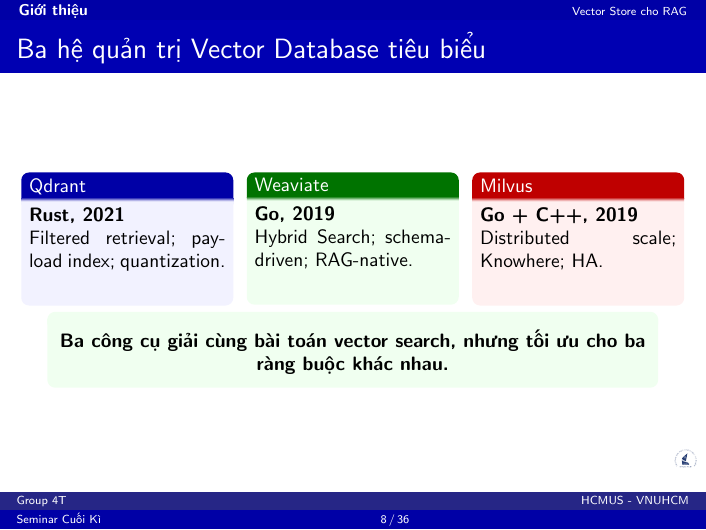

**Nội dung thuyết trình:**

Ba công cụ đều giải quyết bài toán vector search, nhưng có triết lý khác nhau.

Qdrant viết bằng Rust, ra đời năm 2021, nổi bật với filtered retrieval, payload index và quantization.

Weaviate viết bằng Go, ra đời năm 2019, nổi bật với Hybrid Search, schema-driven design và trải nghiệm phát triển ứng dụng RAG.

Milvus dùng Go và C++, ra đời năm 2019, nổi bật với kiến trúc phân tán, Knowhere engine và khả năng High Availability.

**Câu chốt:** Ba công cụ giải cùng một bài toán, nhưng tối ưu cho ba ràng buộc khác nhau.

## Slide PDF 9 - Độ phổ biến và cộng đồng GitHub

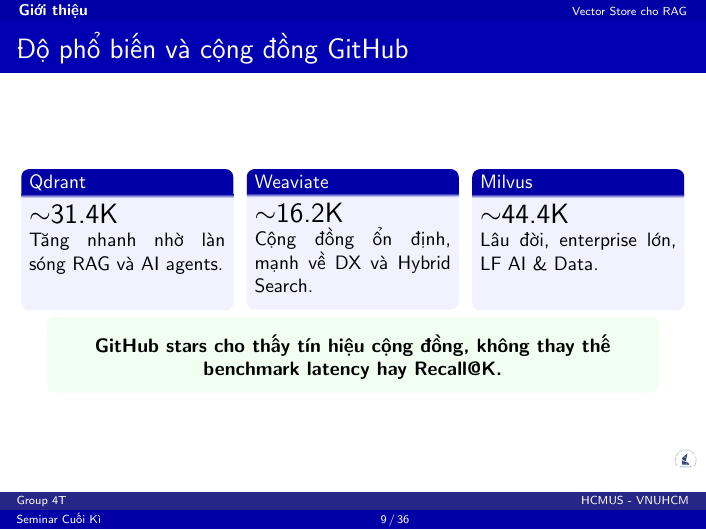

**Nội dung thuyết trình:**

GitHub stars là một tín hiệu về cộng đồng, nhưng không thay thế benchmark.

Milvus có lượng stars cao nhất nhờ ra đời sớm, được dùng trong nhiều bối cảnh enterprise và thuộc hệ sinh thái LF AI & Data. Qdrant tăng trưởng nhanh nhờ làn sóng RAG và AI agents. Weaviate có cộng đồng nhỏ hơn, nhưng nổi bật về developer experience và Hybrid Search.

**Lưu ý khi nói:** Nếu bị hỏi, cần nhấn mạnh số stars có thể thay đổi theo thời gian và chỉ dùng như dữ liệu tham khảo.

## Slide PDF 10 - Mã nguồn mở và mô hình triển khai

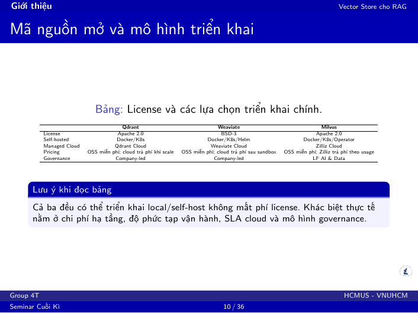

**Nội dung thuyết trình:**

Cả ba đều có thể self-host và đều là mã nguồn mở theo license permissive. Qdrant và Milvus dùng Apache 2.0, Weaviate dùng BSD-3.

Tuy nhiên, trong production, chi phí thật không chỉ nằm ở license. Chi phí lớn hơn thường đến từ hạ tầng, RAM, storage, backup, monitoring, nâng cấp version và khả năng debug khi có sự cố.

**Câu chốt:** License cho phép triển khai rộng, nhưng profile vận hành của mỗi database rất khác nhau.

## Slide PDF 11 - Free tier cloud và giới hạn thử nghiệm

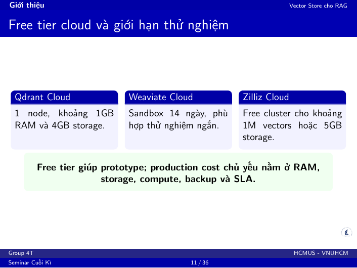

**Nội dung thuyết trình:**

Free tier cloud phù hợp để prototype nhanh, nhưng không nên dùng làm kết luận production. Qdrant Cloud, Weaviate Cloud và Zilliz Cloud đều có gói thử nghiệm với giới hạn riêng về RAM, storage hoặc thời gian.

Trong seminar này, nhóm tập trung vào self-host benchmark để kiểm soát biến số: cùng máy, cùng Docker environment, cùng corpus và cùng query.

**Chuyển giao sang Trực:** Sau phần tổng quan, chúng ta đi vào công cụ đầu tiên: Qdrant, một lựa chọn rất mạnh khi hệ thống RAG cần metadata filter.

## Slide PDF 29 - Giao thức benchmark công bằng

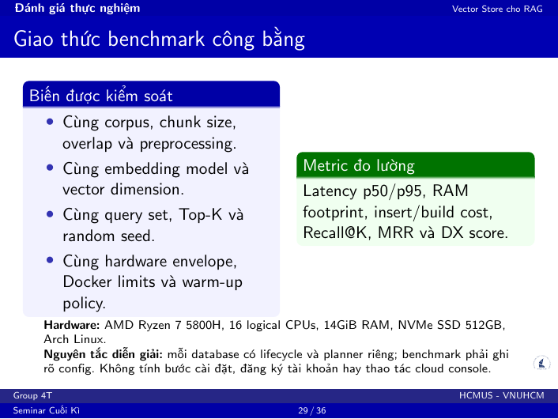

**Nội dung thuyết trình nếu Trí phụ trách phần benchmark setup:**

Để benchmark công bằng, nhóm kiểm soát các biến quan trọng: cùng corpus, cùng chunk size và overlap, cùng preprocessing, cùng embedding model, cùng vector dimension, cùng query set, cùng Top-K và cùng hardware envelope.

Cấu hình HNSW dùng chung là Cosine, M=16, ef_construction=128 và ef_search=64.

Tuy nhiên, công bằng không có nghĩa là ép mọi database có lifecycle giống nhau. Milvus có flush/load, Weaviate có hybrid alpha, còn Qdrant có payload planner. Vì vậy khi đọc kết quả, nhóm luôn gắn số liệu với bối cảnh chạy.

## Slide PDF 30 - Telemetry tài nguyên: latency và RAM

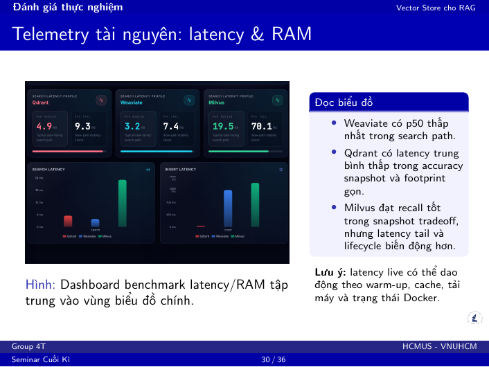

**Nội dung thuyết trình:**

Slide này chuyển từ kiến trúc sang số liệu. Latency live có thể dao động do warm-up, cache, tải Docker, tiến trình nền và trạng thái model local. Vì vậy nhóm dùng snapshot để kết luận và dùng live demo để chứng minh pipeline hoạt động.

Điểm cần đọc là không chỉ nhìn một số trung bình, mà phải nhìn cả profile vận hành. Qdrant có footprint gọn, Weaviate có profile tốt cho hybrid workflow, còn Milvus có recall tốt trong snapshot nhưng lifecycle phức tạp hơn.

**Câu chốt:** Latency chỉ là một phần của câu chuyện; ta còn phải kiểm tra retrieval có đúng hay không.

## Slide PDF 31 - Độ chính xác truy hồi: Recall@K và MRR

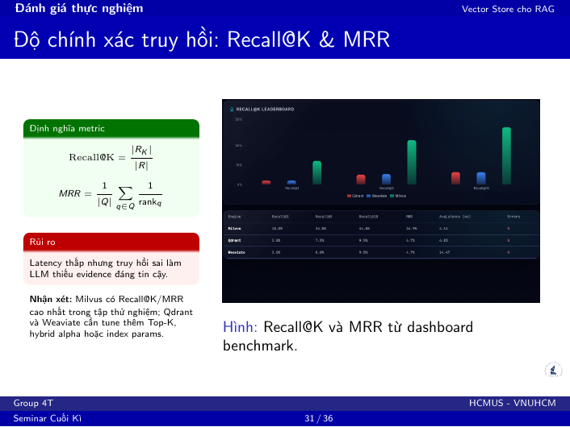

**Nội dung thuyết trình:**

Trong RAG, nhanh nhưng truy hồi sai thì không có giá trị. Nếu Top-K chunk không chứa evidence đúng, LLM sẽ trả lời kém hoặc hallucinate.

Snapshot hiện tại cho thấy Milvus có Recall@1 = 18.0, Recall@5 = 34.0, Recall@10 = 44.0, MRR = 0.2492 và AvgLatency = 4.14 ms.

Qdrant có Recall@10 = 9.5 và AvgLatency = 4.83 ms. Weaviate cũng có Recall@10 = 9.5 nhưng AvgLatency = 14.47 ms trong snapshot này.

**Diễn giải bắt buộc:** Kết quả này là snapshot của project trên một workload cụ thể, không phải chân lý tuyệt đối cho mọi production workload.

## Demo do Trí phụ trách - Dashboard, Accuracy và Tradeoff

**Trang:** `/dashboard`, `/accuracy`, `/tradeoff`  
**Thời lượng:** 2-3 phút tổng cộng.

**Lời thoại demo:**

Đây là dashboard tổng quan của hệ thống. Cùng một pipeline RAG, nhóm gắn vào ba vector database để so sánh. 3D view giúp hình dung embedding space, còn các kết luận kỹ thuật vẫn dựa trên latency, recall và tradeoff.

Ở trang accuracy, nhóm kiểm tra retrieval đúng hay sai bằng Recall@K và MRR. Ở trang tradeoff, nhóm xem khi tăng Top-K thì recall và latency thay đổi như thế nào.

Giá trị của demo là biến việc chọn database thành một quyết định có số liệu, thay vì chọn theo cảm tính.
