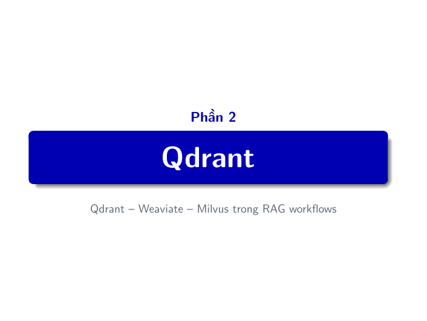
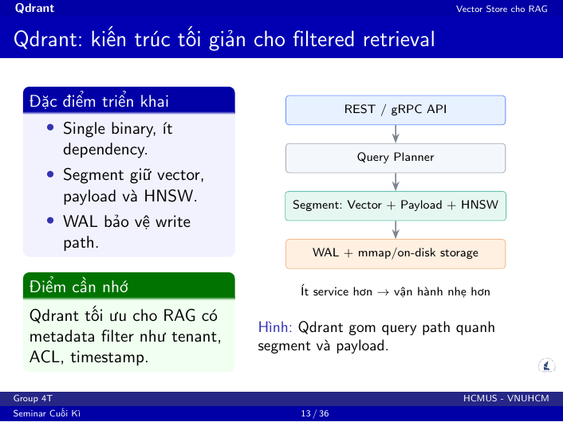
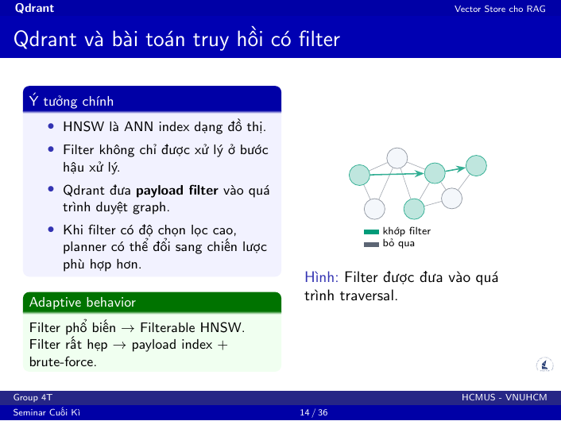
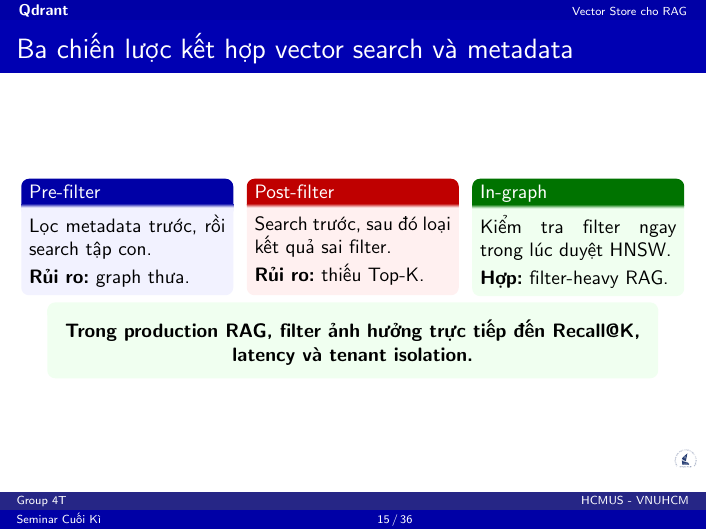
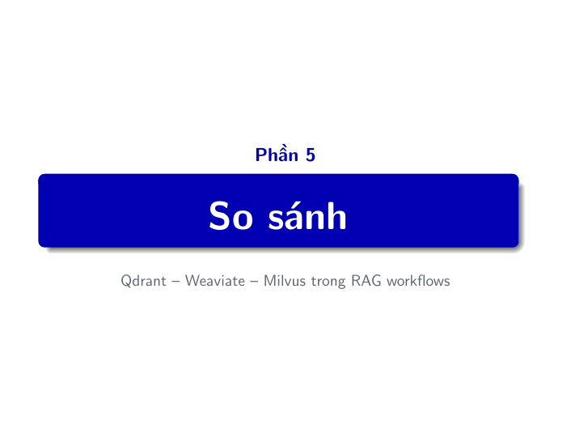
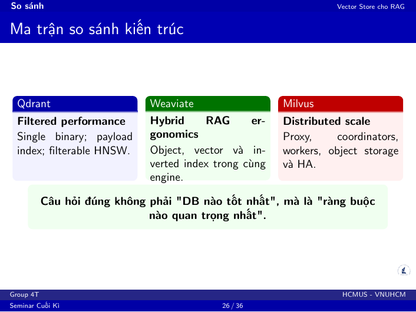
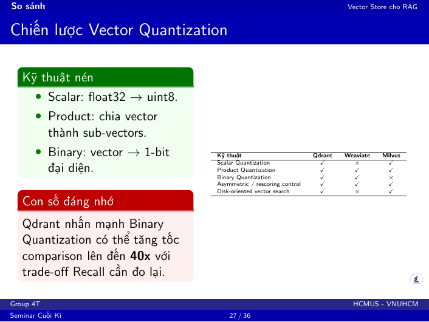

# Kịch bản thuyết trình - Trần Lê Trung Trực (23120165)

**Vai trò:** Qdrant, so sánh kiến trúc, quantization, demo Qdrant.  
**Thời lượng gợi ý:** 8-9 phút.  
**Mục tiêu:** Làm rõ Qdrant phù hợp với RAG có metadata filter, tenant, ACL và yêu cầu triển khai gọn.

## Slide PDF 12 - Divider: Qdrant

**Nội dung thuyết trình:**

Sau phần tổng quan, em sẽ đi vào công cụ đầu tiên là Qdrant. Đây là Vector Database có thiết kế khá gọn, ít dependency, và nổi bật ở bài toán filtered retrieval.

**Chuyển tiếp:** Điểm quan trọng khi đọc Qdrant là đừng chỉ xem nó như một HNSW engine, mà phải nhìn cách nó gắn vector search với payload metadata.

## Slide PDF 13 - Qdrant: kiến trúc tối giản cho filtered retrieval

**Nội dung thuyết trình:**

Qdrant được thiết kế theo hướng tối giản. Nó có thể chạy như một single binary, ít dependency, nên triển khai local hoặc self-host khá nhẹ.

Đơn vị lưu trữ quan trọng là segment. Mỗi segment chứa vector, payload metadata và HNSW index. WAL bảo vệ write path để dữ liệu được ghi bền vững. Việc dùng Rust giúp giảm rủi ro memory bug và không có garbage collection pause như một số runtime khác.

Điểm cần nhớ là Qdrant rất phù hợp với RAG có metadata filter, ví dụ tenant, quyền truy cập, timestamp, loại tài liệu hoặc course id.

**Câu chốt:** Qdrant không chỉ tối ưu vector search, mà tối ưu vector search có điều kiện.

## Slide PDF 14 - Qdrant và bài toán truy hồi có filter

**Nội dung thuyết trình:**

Trong RAG production, filter gần như luôn xuất hiện. Ví dụ một user chỉ được xem tài liệu của phòng ban mình, một sinh viên chỉ truy vấn tài liệu của môn học tương ứng, hoặc hệ thống cần lọc theo thời gian và loại tài liệu.

Nếu filter sau khi search, database có thể trả về nhiều kết quả gần nghĩa nhưng không hợp lệ, dẫn tới thiếu Top-K. Nếu filter trước khi search, tập dữ liệu bị thu hẹp quá mạnh và HNSW graph có thể bị thưa.

Qdrant giải quyết bằng cách đưa payload filter vào quá trình duyệt HNSW. Khi filter rộng, nó vẫn duyệt graph. Khi filter rất hẹp, planner có thể chuyển sang payload index và brute-force trên tập nhỏ.

**Câu chốt:** Filter trong Qdrant không phải chỉ là bước phụ sau search; nó là một phần của query planning.

## Slide PDF 15 - Ba chiến lược kết hợp vector search và metadata

**Nội dung thuyết trình:**

Có ba chiến lược phổ biến khi kết hợp vector search với metadata.

Pre-filter là lọc metadata trước rồi search trên tập con. Cách này dễ hiểu nhưng có nguy cơ làm graph bị thưa.

Post-filter là search vector trước rồi loại kết quả sai filter. Cách này có nguy cơ không đủ Top-K hợp lệ.

In-graph filtering kiểm tra filter trong khi duyệt HNSW. Đây là hướng phù hợp với RAG có nhiều ràng buộc metadata vì nó vừa giữ logic graph traversal, vừa tôn trọng tenant isolation và access control.

**Ví dụ nói nhanh:** Nếu user chỉ có quyền xem tài liệu khoa CNTT, database không được trả tài liệu khoa khác dù vector rất gần.

## Slide PDF 25 - Divider: So sánh

**Nội dung thuyết trình:**

Sau khi đã đi qua từng hệ thống, phần này gom lại các khác biệt chính. Mục tiêu là trả lời câu hỏi: khi nào chọn Qdrant, khi nào chọn Weaviate, và khi nào Milvus đáng đầu tư hơn.

## Slide PDF 26 - Ma trận so sánh kiến trúc

**Nội dung thuyết trình:**

Slide này là phần tóm tắt kiến trúc.

Qdrant nổi bật ở filtered performance: single binary, payload index và filterable HNSW. Đây là lựa chọn mạnh khi hệ thống cần truy vấn nhanh kèm metadata filter.

Weaviate nổi bật ở hybrid RAG ergonomics: object store, vector index và inverted index nằm trong cùng engine. Vì vậy nó dễ dùng khi cần kết hợp keyword và semantic retrieval.

Milvus nổi bật ở distributed scale: có Proxy, Coordinator, Worker, object storage và HA. Nó phù hợp hơn khi corpus rất lớn và cần scale theo từng thành phần.

**Câu chốt:** Câu hỏi đúng không phải là database nào tốt nhất, mà là ràng buộc nào quan trọng nhất trong bài toán.

## Slide PDF 27 - Chiến lược Vector Quantization

**Nội dung thuyết trình:**

Khi corpus lớn, embedding có thể làm RAM trở thành bottleneck. Một vector float32 nhiều chiều nhân với hàng triệu chunk sẽ tốn rất nhiều bộ nhớ.

Quantization là nhóm kỹ thuật nén vector. Scalar quantization chuyển float32 sang uint8 để giảm bộ nhớ khoảng 4 lần. Product quantization chia vector thành các sub-vector rồi mã hóa bằng centroid. Binary quantization đưa vector về biểu diễn 1-bit để tăng tốc comparison.

Nhưng tradeoff là Recall@K có thể giảm. Vì vậy mọi cấu hình quantization đều phải benchmark lại, không thể chỉ nhìn RAM savings.

**Điểm nhấn:** Qdrant có bộ công cụ quantization rất đầy đủ; đây là một lợi thế khi cần tối ưu footprint cho RAG self-host.

## Demo do Trực phụ trách - Qdrant filtered search

**Trang:** `/hybrid` hoặc `/rag-chat`  
**Thời lượng:** 90-120 giây.

**Lời thoại demo:**

Phần demo Qdrant tập trung vào truy vấn có metadata filter. Trong hệ thống RAG nội bộ, mỗi user thường chỉ được xem một phần tài liệu, ví dụ theo tenant, quyền truy cập hoặc loại tài liệu.

Qdrant phù hợp với workload này vì payload filter được xử lý sát với query path. Khi demo, điểm cần quan sát là hệ thống vẫn trả kết quả nhanh khi có điều kiện lọc.

Nếu backend live không ổn định, ta dùng snapshot hoặc screenshot và nói rõ: phần live demo chỉ để chứng minh luồng hoạt động, còn kết luận dựa trên snapshot benchmark đã lưu.

**Câu chốt demo:** Qdrant là lựa chọn mạnh khi ưu tiên latency thấp, triển khai gọn và metadata filter rõ ràng.
