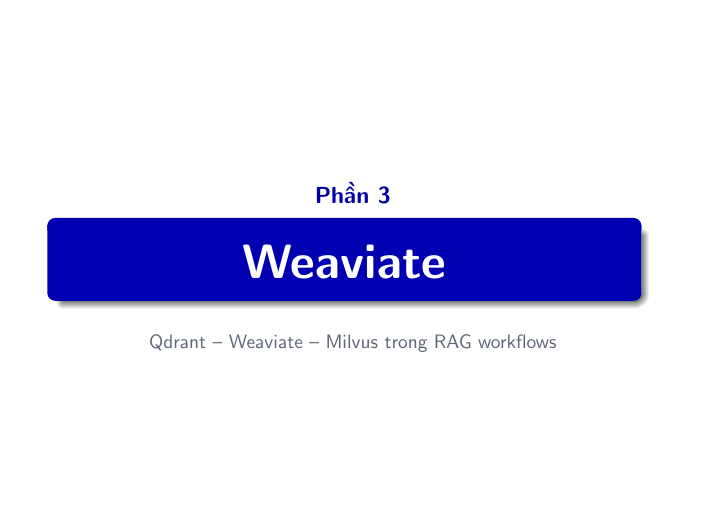
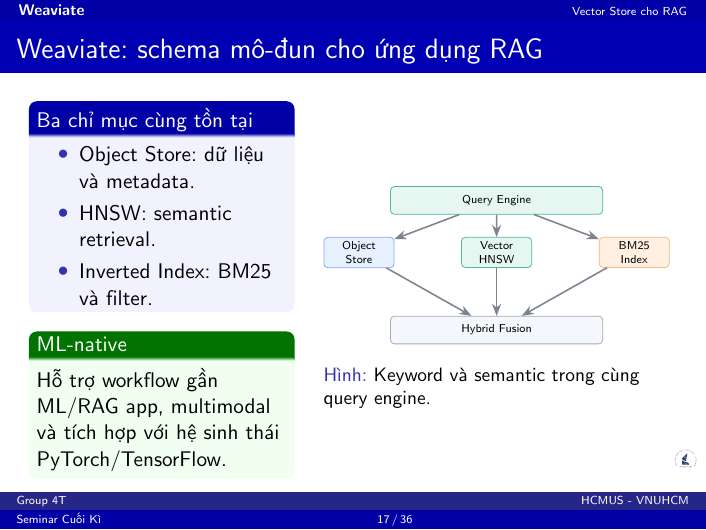
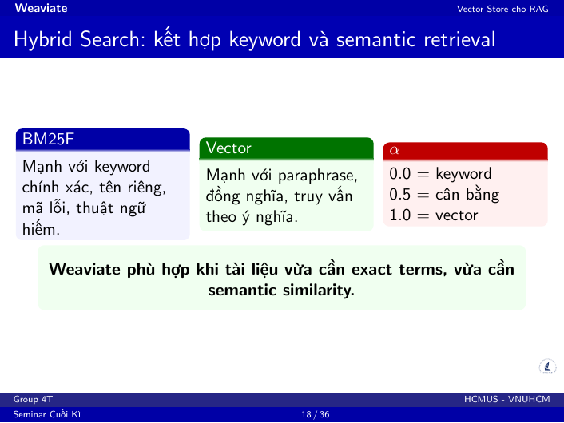
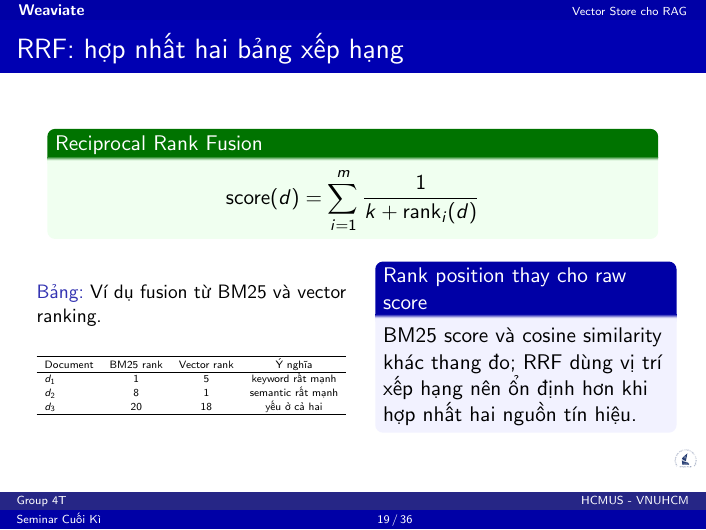
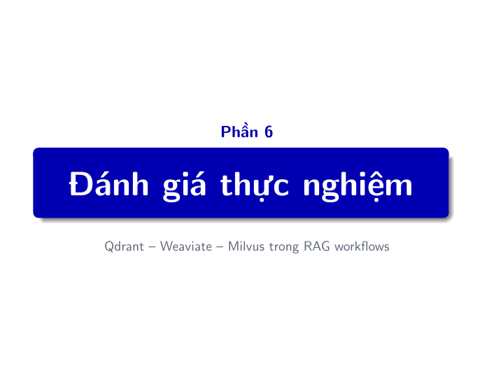
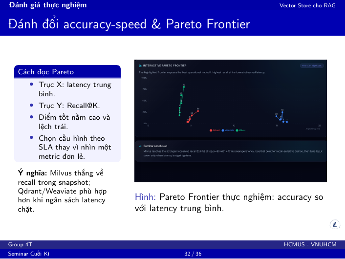

# Kịch bản thuyết trình - Nguyễn Hồ Anh Tuấn (23120185)

**Vai trò:** Weaviate, Hybrid Search, RRF, methodology/tradeoff, demo Weaviate.  
**Thời lượng gợi ý:** 8-9 phút.  
**Mục tiêu:** Làm rõ Weaviate phù hợp với RAG cần kết hợp keyword search và semantic search.

## Slide PDF 16 - Divider: Weaviate

**Nội dung thuyết trình:**

Sau Qdrant, em sẽ trình bày Weaviate. Nếu Qdrant nổi bật ở filtered retrieval, thì Weaviate nổi bật ở Hybrid Search, tức là kết hợp keyword retrieval và semantic vector retrieval trong cùng một hướng truy vấn.

## Slide PDF 17 - Weaviate: schema mô-đun cho ứng dụng RAG

**Nội dung thuyết trình:**

Weaviate không chỉ là một ANN engine. Trong cùng một hệ thống, nó quản lý object store, vector HNSW index và inverted index.

Object Store lưu dữ liệu và metadata. HNSW phục vụ semantic retrieval. Inverted Index phục vụ BM25, keyword search và filter. Vì ba thành phần này cùng tồn tại trong query engine, Weaviate rất tự nhiên khi xây dựng ứng dụng RAG cần cả keyword lẫn semantic.

Weaviate cũng có định hướng ML-native với module system cho vectorizer, generative module và reranker. Điều này giúp developer xây RAG app nhanh hơn.

**Câu chốt:** Weaviate mạnh không phải chỉ vì tìm vector, mà vì nó ghép lexical search và semantic search vào cùng workflow.

## Slide PDF 18 - Hybrid Search: kết hợp keyword và semantic retrieval

**Nội dung thuyết trình:**

Vector search mạnh khi người dùng hỏi bằng cách diễn đạt khác nhưng cùng ý nghĩa. Ví dụ "hệ thống phản hồi chậm" và "latency cao" có thể gần nhau về ngữ nghĩa.

BM25 hoặc keyword search lại mạnh khi câu hỏi chứa tên riêng, mã lỗi, mã sản phẩm hoặc thuật ngữ hiếm. Ví dụ mã lỗi `E042` rất cần exact match, nếu chỉ dùng vector thì có thể bị bỏ sót.

Hybrid Search kết hợp hai tín hiệu này. Tham số alpha điều chỉnh trọng số:

- alpha = 0.0 nghiêng hoàn toàn về keyword.
- alpha = 0.5 cân bằng.
- alpha = 1.0 nghiêng hoàn toàn về vector.

**Câu chốt:** Weaviate phù hợp với tài liệu kỹ thuật vì tài liệu này vừa có thuật ngữ chính xác, vừa có câu hỏi diễn đạt theo ngữ nghĩa.

## Slide PDF 19 - RRF: hợp nhất hai bảng xếp hạng

**Nội dung thuyết trình:**

Khi kết hợp BM25 và vector, một vấn đề là raw score của hai hệ thống khác thang đo. BM25 score và cosine similarity không thể cộng trực tiếp một cách ổn định.

Reciprocal Rank Fusion giải quyết bằng cách dùng vị trí xếp hạng thay cho raw score. Document đứng càng cao trong một ranked list thì đóng góp điểm càng lớn.

Công thức là tổng của `1 / (k + rank_i)` qua các nguồn xếp hạng. Nếu một document đứng hạng cao ở BM25 hoặc vector, nó sẽ được đẩy lên trong ranking cuối.

**Giải thích ví dụ trên slide:** `d1` mạnh về keyword, `d2` mạnh về semantic. RRF cho phép cả hai có cơ hội xuất hiện cao trong kết quả cuối mà không cần chuẩn hóa score phức tạp.

## Slide PDF 28 - Divider: Đánh giá thực nghiệm

**Nội dung thuyết trình:**

Sau khi hiểu kiến trúc của ba database, phần tiếp theo là đánh giá thực nghiệm. Ở đây mục tiêu không phải là tuyên bố một công cụ thắng tuyệt đối, mà là đo cùng một workload để thấy profile của từng công cụ.

## Slide PDF 29 - Giao thức benchmark công bằng

**Nội dung thuyết trình:**

Để benchmark công bằng, nhóm kiểm soát các biến: cùng corpus, cùng chunk size và overlap, cùng preprocessing, cùng embedding model, cùng vector dimension, cùng query set, cùng Top-K và cùng random seed.

Cấu hình HNSW dùng chung là Cosine, M=16, ef_construction=128 và ef_search=64.

Tuy nhiên, mỗi database có lifecycle riêng. Milvus có flush và load. Weaviate có hybrid alpha. Qdrant có payload planner. Vì vậy khi so sánh, nhóm vừa giữ input công bằng, vừa ghi rõ đặc thù của từng engine.

**Câu chốt:** Benchmark công bằng là kiểm soát biến số, không phải bỏ qua khác biệt kiến trúc.

## Slide PDF 32 - Đánh đổi accuracy-speed và Pareto Frontier

**Nội dung thuyết trình:**

Slide này cho thấy tradeoff giữa accuracy và latency. Trục X là latency trung bình, trục Y là Recall@K. Điểm tốt là điểm nằm cao và lệch trái, tức là recall cao nhưng latency thấp.

Khi tăng Top-K, hệ thống lấy nhiều context hơn nên recall có thể tăng. Nhưng chi phí retrieval, reranking và context cho LLM cũng tăng. Vì vậy chọn Top-K không nên theo cảm tính, mà phải dựa trên SLA và chất lượng mong muốn.

Snapshot hiện tại:

- Milvus top_k=10 đạt Recall 44.0 với AvgLatency khoảng 3.88 ms.
- Qdrant top_k=10 đạt Recall 9.5 với AvgLatency khoảng 4.87 ms.
- Weaviate top_k=10 đạt Recall 9.5 với AvgLatency khoảng 15.49 ms.

**Diễn giải bắt buộc:** Weaviate trong snapshot dense benchmark không phải lúc nào nhanh nhất, nhưng lợi thế chính của Weaviate nằm ở Hybrid Search khi workload cần keyword + semantic.

## Demo do Tuấn phụ trách - Weaviate Hybrid Search

**Trang:** `/hybrid`  
**Thời lượng:** 90-120 giây.

**Lời thoại demo:**

Phần demo Weaviate tập trung vào Hybrid Search. Một query có thể cần cả keyword exact match và semantic similarity.

Khi alpha nhỏ, kết quả nghiêng về keyword/BM25, phù hợp với mã lỗi, tên riêng hoặc thuật ngữ. Khi alpha lớn, kết quả nghiêng về vector, phù hợp với câu hỏi diễn đạt tự nhiên.

Điểm cần nhấn mạnh là Weaviate làm hybrid search khá tự nhiên trong cùng query engine, thay vì phải tự ghép external keyword system với vector database.

**Câu chốt demo:** Weaviate phù hợp khi ứng dụng RAG cần trả lời trên tài liệu kỹ thuật, nơi keyword chính xác và ngữ nghĩa đều quan trọng.
